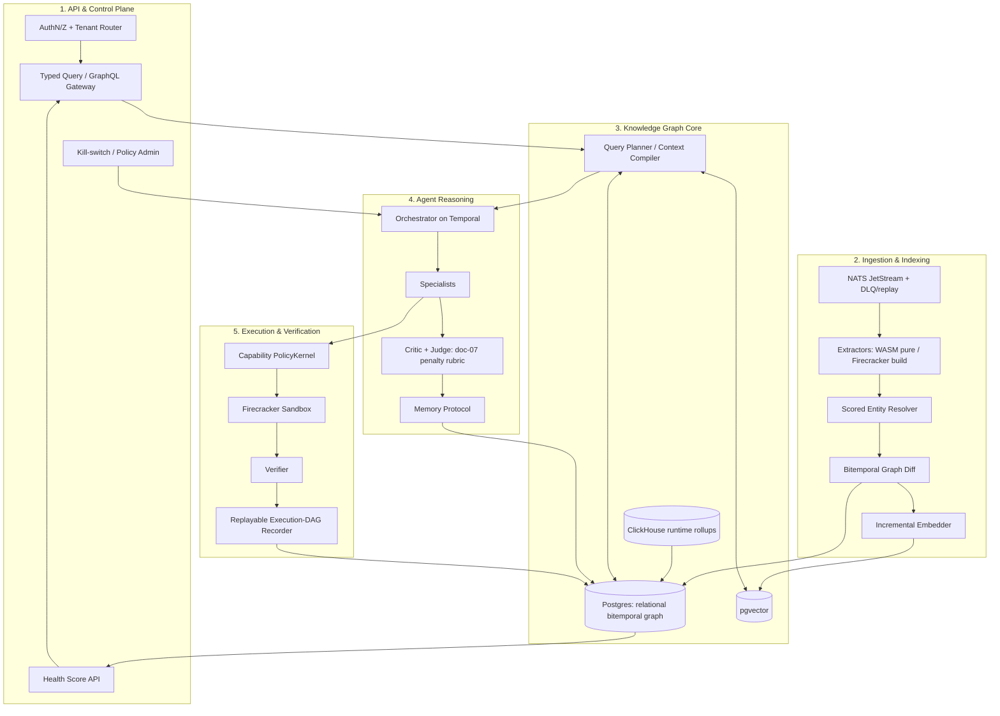

# 00 — Production Blueprint (Consolidated)

> The single decided design. Where the domain docs (01–07) explore options, this file states the choice. Conflicts resolve in favor of this document; rationale lives in [`DECISIONS.md`](./DECISIONS.md).

CodeGraph builds a **bitemporal, probabilistic knowledge graph** that fuses eight software domains, exposes it as **shared memory for a critique/judge agent swarm**, and records **replayable execution DAGs** so autonomous code changes are auditable. A graph-derived **health score** turns the graph into an accountable, agent-actionable signal.

---

## Final Architecture — Five Planes

**Plane responsibilities**

1. **API & Control** — single front door: typed query/GraphQL gateway, authn/z, per-tenant routing, health-score reads, kill-switch/policy admin.
2. **Ingestion & Indexing** — NATS JetStream (DLQ + replay + idempotency keys) → pluggable extractors (WASM for pure parse, Firecracker for build) → scored entity resolver → bitemporal graph diff → incremental embed.
3. **Knowledge Graph Core** — relational bitemporal property graph on PostgreSQL + pgvector (co-located, graph-ID joins) + ClickHouse (runtime rollups) + Query Planner / Context Compiler.
4. **Agent Reasoning** — Orchestrator on Temporal → specialists → critic → judge (scoring reuses the doc-07 penalty model) → memory protocol. Budgeted, termination-guaranteed loop.
5. **Execution & Verification** — capability PolicyKernel → Firecracker sandbox → Verifier (tests/types/contracts/CVE/perf/invariants) → content-addressed replayable Execution-DAG recorder.

---

## Finalized Technology Stack

| Layer | Decision | Scale exit |
|---|---|---|
| Parse | Tree-sitter (syntax) + SCIP (cross-file semantics) | add languages incrementally |
| Static analysis | SCIP + per-language analyzers; dataflow/taint deferred to Phase 2 | no custom engine until forced |
| Graph store | **PostgreSQL relational bitemporal graph** (ADR-001) | Neo4j / Memgraph / Neptune when traversal SLOs missed |
| Vectors | **pgvector** (ADR-002) | Qdrant when ANN recall/scale demands |
| Runtime/TS | OpenTelemetry → ClickHouse rollups; eBPF Phase 2+ | — |
| Event bus | **NATS JetStream** + DLQ/replay (ADR-003) | Kafka if ecosystem needed |
| Sandbox | Firecracker (code) + WASM (pure extractors) | — |
| Orchestration | **Temporal** durable workflows (ADR-004) | — |
| LLMs | Tiered, provider-agnostic (small=route/triage, large=synthesis/judge) | — |
| Embeddings | Code-aware + general, content-hash cached | — |

---

## Service Interaction (request path)

Source webhook → JetStream → extractor pool → scored entity resolver → bitemporal graph diff → Postgres versioned write + pgvector embed → typed change-event → Orchestrator (Temporal) → Context Compiler queries graph → specialists/critic/judge (doc-07 rubric, termination-bounded) → PolicyKernel grants minimal capabilities → Firecracker verify → Execution-DAG recorder writes `ExecutionRun` + beliefs back to graph → health score recomputes the delta → API surfaces result.

---

## Cross-cutting Strategies

- **Deployment:** SaaS multi-tenant (per-org schema/partition) + VPC/self-hosted Helm chart from Phase 1.
- **Testing:** golden-repo extractor fixtures (parser determinism), replay-equality tests (audit DAG byte-identity), judge-vs-human agreement harness, contract tests on the typed query API.
- **Monitoring:** platform OTel + self-queryable execution DAGs; SLOs on push-update latency, verification pass-rate, replay fidelity.
- **Security:** capability tokens (no ambient authority); untrusted-content extractors run sandboxed and emit BELIEF-only (prompt-injection boundary); secrets sandbox-injected, never in graph/model; documented threat model.
- **Scaling:** shard by repo/module; ClickHouse edge rollups; budgeted/tiered belief re-derivation; lazy cold-subgraph loading.

---

## Refined Roadmap (measurable gates)

| Phase | Window | Exit gate (measurable) |
|---|---|---|
| **P0 Core Loop** | 0–2 mo | Verified PR on real OSS repo; byte-identical replay; 100k-LOC bootstrap < 10 min |
| **P1 Wedge (dep upgrades)** | 2–6 mo | ≥3 design partners auto-merge green-CI bumps; judge-vs-human ≥ 80%; first-try verify ≥ 60% |
| **P2 Multi-domain + Runtime** | 6–12 mo | Causal "why slow / why broke" answers; incremental push update < 5 s P95 @ 1M LOC |
| **P3 Platform** | 12–24 mo | External team ships a specialist on the public API; SLOs met |

> Performance figures are **design goals, unvalidated** until the P0/P2 benchmark harness confirms them.

---

## Implementation Status

| Component | Status |
|---|---|
| Bitemporal FACT/BELIEF graph core + as-of queries | **Implemented** (`codegraph/`, see tests) |
| `neighbors` / `semantic_search` retrieval | **Implemented** |
| Extractors / agent loop / sandbox | Designed (docs 03–05); not yet built |

See [`08_api_and_schema.md`](./08_api_and_schema.md) for the concrete schema + typed-query contract, and the `codegraph/` package for the running Phase-0 spine.
