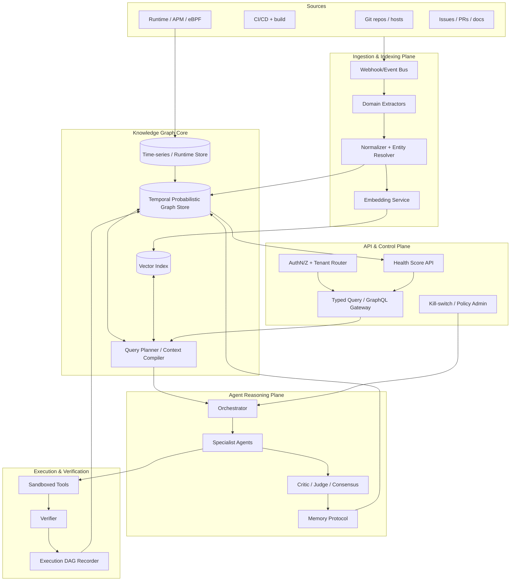

# 01 — System Architecture

## Design Principles
1. **Graph-native, agent-first.** The knowledge graph is the center of gravity; everything reads/writes it.
2. **Incremental everything.** Indexing, embeddings, and graph updates are incremental and event-driven — never full re-scans.
3. **Temporal + probabilistic by default.** Every fact carries provenance, confidence, and validity interval.
4. **Verifiable execution.** Every agent action is recorded into a replayable DAG (so runs are auditable and reproducible).
5. **Separation of truth vs. belief.** Extracted facts (high-trust, from parsers/runtime) are distinct from inferred beliefs (agent-generated, lower-trust, revisable).

---

## High-Level Topology

---

## Component Breakdown

### 1. Ingestion & Indexing Plane
- **Event Bus / Webhooks:** receives push/PR/issue/CI/runtime events; the system reacts to deltas only.
- **Domain Extractors:** one per domain (code, deps, docs, ownership, runtime, social). Pluggable, language/host-specific. (See `03_indexing_pipeline.md`.)
- **Normalizer + Entity Resolver:** maps raw extractions to the canonical ontology; resolves identities (same function across commits, same person across handles).
- **Embedding Service:** computes embeddings for retrievable nodes (functions, docs, issues) → vector index.

### 2. Knowledge Graph Core
- **Graph Store:** temporal + probabilistic property graph (nodes/edges carry `confidence`, `provenance`, `valid_from/valid_to`). (See `02_knowledge_graph_schema.md`.)
- **Vector Index:** ANN over node embeddings, joined to graph IDs (hybrid retrieval).
- **Runtime/Time-series Store:** high-volume trace/metric data, summarized into graph edges (e.g., `CALLS_AT_RUNTIME` with latency stats).
- **Query Planner / Context Compiler:** translates agent queries into hybrid graph+vector traversals; computes the minimal optimal context to feed a model (information-theoretic selection).

### 3. Agent Reasoning Plane
- **Orchestrator:** decomposes a task into a plan/DAG; assigns sub-tasks to specialists; manages the critique/judge loop.
- **Specialist Agents:** narrow experts (Architect, Security, Performance, Refactor, Docs, Test, Dependency). Each has graph views + tools scoped to its domain.
- **Critic / Judge / Consensus:** agents critique each other's outputs; a judge scores against graph-derived criteria; consensus or escalation decides the winning output.
- **Memory Protocol:** how agents read/write beliefs to the graph (typed, provenance-tagged, revisable). (See `04_agent_framework.md`.)

### 4. Execution & Verification Plane
- **Sandboxed Tools:** capability-scoped execution (run tests, apply patch, query DB) in isolated microVMs/WASM.
- **Verifier:** checks agent outputs against properties (tests pass, types check, no contract break, graph invariants hold).
- **Execution DAG Recorder:** records every model call, tool call, and decision into a content-addressed, replayable DAG → written back to the graph for audit + learning.

### 5. API & Control Plane
- **Typed Query / GraphQL Gateway:** the single front door; exposes the typed query verbs (doc 02) + health-score reads (doc 07). No raw graph dumps.
- **AuthN/Z + Tenant Router:** authenticates callers, enforces per-org tenant isolation, routes to the correct graph partition.
- **Health Score API:** serves drillable scores/trends from the graph (doc 07) — a first-class product surface.
- **Kill-switch / Policy Admin:** org-level controls — autonomy levels, rate limits, emergency stop on the agent plane (doc 05).

---

## Data Flow (Example: "Why is `/checkout` slow?")
1. Orchestrator parses intent → plan: locate endpoint → gather static call graph → join runtime latency → hypothesize → verify.
2. Context Compiler retrieves the `/checkout` handler node, its `CALLS`/`CALLS_AT_RUNTIME` subgraph, recent latency edges, related incidents/PRs.
3. Performance specialist forms hypotheses; Critic challenges with counter-evidence from the graph; Judge scores hypotheses by graph support.
4. Winning hypothesis → optional verification experiment in sandbox → result recorded → graph updated with a new belief edge (with confidence + provenance).

---

## Cross-Cutting Concerns
- **Multi-tenancy & isolation:** per-org graph partitions; strict tenant boundaries; no cross-tenant data in embeddings/models.
- **Security:** capability-based tool access (no ambient authority); secrets never enter the graph; PII handling for ownership data.
- **Scale:** graph sharded by repo/module; runtime data tiered (hot in TS store, summarized into graph).
- **Cost control:** context compiler minimizes tokens; embeddings + retrieval cached; small models for routing, large for reasoning.
- **Observability:** the system instruments itself — its own execution DAGs are queryable.

## Deployment Topology
- **SaaS** (managed graph + agents) and **self-hosted/VPC** (for orgs that won't ship code externally — the realistic enterprise wedge).
- Connectors: GitHub/GitLab/Bitbucket, CI (GH Actions/Jenkins), APM (OTel/Datadog), trackers (Jira/Linear/GH Issues).
