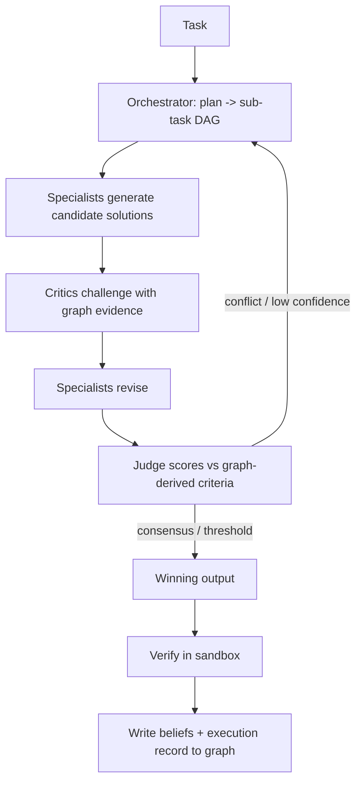

# 04 — Agent Framework

The differentiator: **a swarm of specialized agents that share the knowledge graph as memory, critique each other, and judge solutions against graph-derived ground truth** — multi-agent debate-and-consensus, but anchored to a verifiable world model instead of unverifiable opinion.

## Core Tenets
1. **Graph is shared memory.** Agents don't pass giant prompts around; they read/write typed facts + beliefs to the graph.
2. **Specialists over generalists.** Narrow agents with scoped graph views + tools outperform one mega-agent and are independently improvable.
3. **Critique is structural.** Critics challenge claims using graph evidence (`SUPPORTED_BY`/`CONTRADICTED_BY`), not opinion.
4. **Judgment is grounded.** A judge scores candidate outputs against measurable, graph-derived criteria.
5. **Every claim is provenanced + revisable.** Beliefs written by agents carry confidence + author + model version and can be contradicted later.

---

## Agent Roster (initial specialists)

| Agent | Scope | Primary graph views | Tools |
|---|---|---|---|
| **Orchestrator** | Plan, decompose, route, manage loop | task DAG, agent registry | spawn/judge |
| **Architect** | Structure, boundaries, design intent | architecture + design-doc subgraph | graph query |
| **Navigator** | Locate relevant code/context | full graph + vector | semantic search, traversal |
| **Refactor** | Code change synthesis | call/dataflow subgraph | edit, run tests (sandbox) |
| **Security** | Vulns, taint, authz | deps + dataflow + endpoints | SCA, taint query |
| **Performance** | Latency, hot paths | runtime + call graph | trace query, profiling |
| **Dependency** | Upgrades, CVEs, licenses | dependency subgraph | resolver, build |
| **Test** | Coverage, test synthesis | code + coverage | run tests, gen tests |
| **Docs/Intent** | Doc↔code consistency | docs + code | doc gen, diff |
| **Critic** | Challenge any claim | claim + evidence subgraph | counter-evidence query |
| **Judge** | Score & select outputs | criteria + evidence | scoring rubric |

Agents are **declarative**: each defines `{ domain, graph_view, tools, reasoning_model, success_criteria }`. New specialists are added without touching the core.

---

## The Collaboration Loop



### 1. Plan
Orchestrator turns the task into a sub-task DAG, picks specialists, and defines success criteria (e.g., "tests pass + no contract break + p95 not regressed").

### 2. Generate
Each assigned specialist queries its graph view (via the Context Compiler — minimal optimal context) and proposes a candidate + its `HYPOTHESIZES` claims with supporting graph nodes.

### 3. Critique
Critic agents attempt to falsify claims: query the graph for contradicting evidence (broken contracts, owner disagreement, runtime data conflicting with assumption). Attach `CONTRADICTED_BY` / `SUPPORTED_BY` edges.

### 4. Revise
Specialists incorporate critiques; weak claims are dropped or strengthened with more evidence.

### 5. Judge (concrete scoring)
Judge computes a scalar score per candidate `c` and selects `argmax`. The rubric **reuses the doc-07 penalty model** so "ground truth" means the same thing whether we are measuring a codebase or judging an agent:
```
score(c) =  w_e · evidence(c)        // net graph support
          + w_v · verification(c)     // fraction of sandbox checks passed (doc 05)
          - w_r · risk(c)             // doc-07 penalty over the change's blast cone
evidence(c)   = Σ_s confidence_s  −  Σ_t confidence_t      // SUPPORTED_BY − CONTRADICTED_BY (noisy-OR de-correlated, doc 02)
risk(c)       = Σ_i severity_i · confidence_i · blast_radius_i · recency_i   // doc-07 penalty
```
Defaults `w_e=0.4, w_v=0.4, w_r=0.2` (configurable per task-type). `verification(c)` is mandatory: a candidate that fails a hard check (tests/types/contract) scores `−∞` and cannot win.

**Termination guarantees (no infinite loops):**
- **Max critique rounds** `R` (default 3). After `R`, the highest-scoring candidate wins or the task escalates.
- **Tie-break:** highest `evidence(c)`; still tied → lowest `risk(c)`; still tied → escalate to human.
- **Hard budget:** token / wall-clock / tool-call / blast-radius caps (doc 05). Exhausting any budget forces escalation, never silent acceptance or another re-plan.
- **Escalate when:** best `score < threshold`, candidates conflict above a margin, or budget exhausted.

### 6. Verify & Commit
Winning output runs through the Verifier (doc 05); results + the full reasoning are recorded as an `ExecutionRun` and distilled into durable beliefs.

---

## Memory Protocol (read/write contract)
- **Read:** typed queries only (`neighbors`, `semantic_search`, `causal_path`, `conflicts`) — never raw dumps. The Context Compiler bounds tokens.
- **Write:** agents emit `Belief` facts with mandatory `{confidence, provenance(model+version), supporting_node_ids}`. Writes are append-only; contradictions coexist.
- **Working memory vs. durable memory:** ephemeral scratch (per task, discarded) vs. promoted beliefs (validated, written to graph for future tasks). Promotion requires passing the judge threshold.
- **Conflict resolution:** the graph never silently overwrites. Conflicting beliefs are kept; the judge resolves per-task using confidence + recency + verification.

## Why This Is Defensible
- The **consensus + grounding loop** turns stochastic agents into a system whose outputs are checkable against a shared world model — hard to replicate without the graph underneath.
- **Compounding:** each resolved task adds validated beliefs + judged exemplars → better future retrieval and better judge calibration. The swarm gets smarter per repo over time.
- **Specialist library** becomes a moat: a growing set of tuned, graph-aware experts and critique strategies.

## Learning Loop
- Judge decisions + verification outcomes become training signal to calibrate confidence and improve routing (which specialist for which task).
- Successful execution DAGs become **exemplars** retrievable for similar future tasks (few-shot from real, verified runs — not synthetic).
