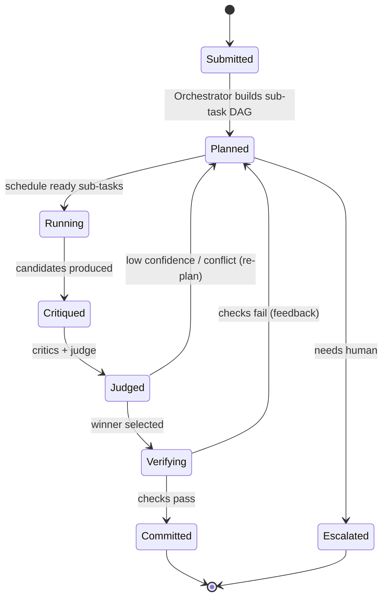

# 05 — Execution Model

How a task runs end-to-end: scheduling, sandboxed action, verification, and **replayable, auditable execution** — the property that lets orgs trust autonomous agents in their codebase.

## Task Lifecycle

## 1. Scheduling
- Task → **sub-task DAG**; independent sub-tasks run in parallel, dependent ones gated by predecessors.
- A bounded worker pool executes ready nodes; the orchestrator advances the DAG as results arrive.
- **Budgets** per task: token budget, wall-clock, tool-call count, and a *blast-radius* cap (max files/services a single autonomous task may touch).

## 2. Sandboxed Action (capability-based)
Every side-effecting tool runs in an isolated sandbox (microVM/WASM/container) with **explicit, revocable capabilities** — no ambient authority.
- Capabilities are tokens: `read:repo/x`, `run:tests`, `write:branch/agent-*`, `net:none`.
- The agent requests capabilities; the **PolicyKernel** grants the minimal set for the sub-task; every privileged action is logged with provenance.
- Agents **never** push to protected branches directly — they open PRs on agent branches.
- Secrets are injected by the sandbox, never exposed to the model or written to the graph.

## 3. Verification Layer
Before any output is accepted, the Verifier checks it against properties derived from the graph + task criteria:
| Check | Source |
|---|---|
| Tests pass | run in sandbox |
| Types check / compiles | language toolchain |
| No public contract broken | `CONFORMS_TO` edges + diff |
| No new CVE / license violation | dependency subgraph |
| Perf not regressed | runtime baseline edges |
| Graph invariants hold | schema constraints |
| Ownership respected | `OWNS` edges → require review routing |
Failures feed back as structured critique → re-plan, not silent acceptance.

## 4. Execution DAG Recorder (the trust moat)
Every run is recorded as a **content-addressed, replayable DAG**:
- Each node = one model call / tool call / decision, capturing: inputs (hashed), prompt, model+version, output, capabilities used, graph queries issued, and result.
- The DAG is written to the graph as an `ExecutionRun` linked to the artifacts it produced and the beliefs it created.
- **Replay:** re-run a task deterministically by replaying recorded model outputs (cached, content-addressed) and tool results → reproduce *exactly* why an agent did something.
- **Fork/diff:** branch a run from any node with a changed input/model to compare outcomes (A/B reasoning).

> This makes agent behavior **auditable and reproducible** — the requirement for autonomous agents in regulated / high-stakes codebases, and a network-effect-friendly trace format.

## 5. Safety & Control
- **Autonomy levels:** `suggest` (PR draft, human merges) → `assisted` (auto-PR, human review) → `autonomous` (auto-merge within scoped, low-risk policies, e.g., dep bumps with green CI). Per-repo, per-task-type, opt-in.
- **Blast-radius governor:** tasks exceeding configured scope require human approval before commit.
- **Rollback:** every autonomous change is a revertible commit; the graph tracks `CAUSED` links so a regression can be traced and reverted automatically.
- **Kill switch & rate limits:** org-level controls; anomaly detection on agent behavior via self-instrumentation.
- **Human-in-the-loop gates:** ownership-sensitive or low-confidence changes route to the right owner (from `OWNS` edges).

## 6. Cost & Latency Model
- **Tiered models:** small/cheap models for routing, retrieval ranking, and critique triage; large models for synthesis and judgment.
- **Context Compiler** minimizes tokens per call (information-theoretic minimal context).
- **Caching:** identical (content-addressed) model calls and tool results are reused across runs — cuts cost and enables replay.
- **Speculative parallelism:** run multiple candidate solutions concurrently; the judge prunes — trade compute for latency on high-value tasks.

## 7. Outputs
A completed task yields:
1. The artifact (PR, patch, report, answer) with linked evidence.
2. An `ExecutionRun` audit record (replayable).
3. New validated beliefs written to the graph (compounding memory).
4. Calibration signal for the learning loop (doc 04).
