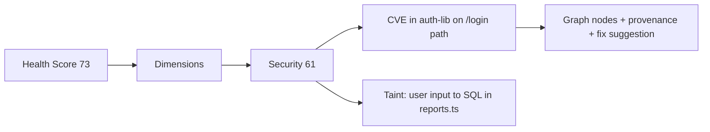

# 07 — Codebase Health Score

A continuously-computed, explainable **0–100 health score** for a codebase (and any sub-scope), derived from the knowledge graph. Because the graph already fuses static structure, runtime behavior, dependencies, ownership, and history, the score is **multi-dimensional and causal** — not a lint count. It is a first-class product surface and a sharp GTM hook.

> **Why this matters as a product:** a single trending number that engineering leaders track, that agents are *tasked to improve*, and that turns the graph from passive memory into an accountable, actionable signal. It also creates a natural feedback loop: agents fix issues → score rises → measurable ROI.

---

## What "Errors" Means Here
The score aggregates **error/risk signals** the graph already captures, spanning far beyond compiler errors:

| Class | Example signals (graph-sourced) | Domain |
|---|---|---|
| **Correctness** | compile/type errors, failing tests, broken contracts (`CONFORMS_TO` violated) | code, API |
| **Static defects** | nullability/taint issues, unreachable code, high cyclomatic complexity | code, dataflow |
| **Security** | open CVEs (`DEPENDS_ON`→cves), taint-to-sink paths, missing authz on `Endpoint` | deps, security |
| **Runtime health** | error_rate / p99 regressions on `CALLS_AT_RUNTIME`, incident `CAUSED` links | runtime |
| **Dependency hygiene** | outdated/EOL deps, license violations, version drift | deps |
| **Test integrity** | coverage gaps on hot paths, flaky tests, untested public APIs | test |
| **Maintainability** | god files, cyclic module deps, dead code, churn vs. complexity | architecture |
| **Knowledge risk** | unowned/orphaned code (`OWNS` missing), bus-factor=1, stale design docs | ownership, docs |
| **Doc/intent drift** | code contradicting `INTENDS`/`DESCRIBES` beliefs | docs |

Each signal is already (or derivable as) a node/edge in the graph, so scoring is a **query + aggregation**, not a new analysis stack.

---

## Score Model

### Dimension scores (each 0–100)
The overall score is a weighted roll-up of dimension sub-scores:

| Dimension | Weight (default) | Rationale |
|---|---|---|
| Correctness | 0.22 | Broken code is the highest-severity signal |
| Security | 0.20 | Exploitable paths / CVEs are existential |
| Runtime reliability | 0.16 | Real user impact (requires runtime domain) |
| Maintainability | 0.14 | Long-term velocity |
| Test integrity | 0.12 | Confidence to change safely |
| Dependency hygiene | 0.10 | Supply-chain + upgrade debt |
| Knowledge/ownership risk | 0.06 | Bus-factor, orphaned code |

Weights are **configurable per org** and per scope (a payments service weights Security higher).

### From signals to a sub-score
For each dimension:
```
penalty = Σ_i  severity_i × confidence_i × blast_radius_i × recency_i
normalized_penalty = penalty / penalty_ref      // penalty_ref = per-dimension calibration constant (see below)
sub_score = 100 × exp( -k · normalized_penalty )    // bounded, diminishing
```
- **severity** — signal class weight (a security sink ≫ a style nit).
- **confidence** — from the fact/belief envelope (doc 02); low-confidence beliefs penalize less.
- **blast_radius** — from the call/dependency graph: an error in a widely-called function hurts more than in a leaf. **This is the moat** — most tools can't weight by graph centrality + runtime traffic.
- **recency** — newer/regressing issues weigh more than long-known, accepted ones.
- **`penalty_ref`** — per-dimension normalization constant so `normalized_penalty ≈ 1.0` at a "typical bad" penalty level; set from the corpus penalty distribution (default = the 90th-percentile observed penalty for that dimension) and recalibrated against incident history.
- **`k`** — decay steepness, default `k = ln(2) ≈ 0.693` so `normalized_penalty = 1.0` yields a 50/100 sub-score (one "reference unit" of debt halves the score); tuned per dimension during calibration.
- Exponential decay keeps the score bounded (0–100) and makes the first fixes matter most.

### Blast-radius weighting (graph-native differentiator)
A defect's impact = function of:
- **Static fan-in** — how many callers/dependents (graph traversal).
- **Runtime traffic** — `CALLS_AT_RUNTIME` count/criticality on that path.
- **Boundary exposure** — is it reachable from a public `Endpoint`?
- **Ownership sensitivity** — touches unowned or bus-factor-1 code.

A linter says "10 issues." CodeGraph says "this 1 issue sits on your highest-traffic checkout path reachable from a public endpoint with no owner → fix this first."

---

## Explainability (non-negotiable)
Every score is **drillable**:
- Score → dimension breakdown → ranked list of contributing issues → the exact graph nodes/edges + provenance for each.
- "Why did the score drop 4 points this week?" → diff of contributing signals between two commits (the graph is temporal, so this is a `valid_from/valid_to` query).
- No black-box number. Each point lost maps to concrete, located, evidenced issues.



---

## Trends & Temporal Tracking
Because the graph is bitemporal (doc 02):
- **Score over time** per repo/service/team/owner.
- **Regression alerts:** a PR that lowers the score triggers a warning *before merge* (score becomes a CI gate, optionally blocking).
- **Attribution:** which commits/PRs/people moved the score (from `MODIFIES`/`AUTHORED` edges) — for accountability, not blame.
- **Forecast:** debt accrual rate (churn vs. complexity trend) → projected score trajectory.

---

## Agent Integration (closing the loop)
The score is not just a dashboard — it **drives the agent swarm** (docs 04/05):
1. The score's ranked issue list becomes a **task backlog** for specialists (Security agent claims taint paths, Dependency agent claims CVEs, Refactor agent claims complexity hotspots).
2. The Orchestrator prioritizes by **score-impact-per-effort** (max score gain ÷ blast radius/risk).
3. Agents open verified PRs (doc 05); on merge, the score recomputes incrementally and the gain is attributed to the run.
4. **North-star tie-in:** "verified autonomous changes merged/week" (doc 06) now has a companion outcome metric: **health-score points recovered/week** — direct, quantifiable ROI for buyers.

> This makes the score *self-improving infrastructure*: the same graph that measures the problem powers the agents that fix it, and the fixes are re-measured against the same ground truth.

---

## Scope Flexibility
Score any graph sub-scope via the same query:
- Whole repo / monorepo.
- Per service, module, or directory.
- Per team or per owner (from `OWNS` edges).
- Per PR (delta score — the CI gate).
- Per "blast cone" of a proposed change.

## Anti-Gaming & Calibration
- **Severity/confidence weighting** resists suppression: silencing a warning doesn't help if the underlying graph fact (e.g., a real taint path) persists.
- **Verification-grounded:** correctness/test signals come from actual sandbox runs (doc 05), not self-reported config.
- **Calibration:** dimension weights and `k` are tuned against incident history — dimensions that historically predicted real incidents get up-weighted (the score learns what actually correlates with failure).
- **Accepted-risk register:** teams can explicitly accept a risk (logged, time-boxed); it stops penalizing but stays visible — transparent, not hidden.

## Implementation Notes (fits existing pipeline)
- Computed **incrementally**: a graph delta (doc 03) recomputes only affected signals and the dimensions they roll into — no full re-scan.
- Stored as temporal nodes (`HealthScore` snapshots linked to `commit_sha`) so trends are free.
- Exposed via the typed query API (doc 02) + a dashboard surface; PR gate via the CI connector.
- **Phase fit:** ships partial from Phase 1 (Correctness + Security + Dependency dimensions — the wedge domains), expands to Runtime/Maintainability as those extractors land (Phase 2, doc 06).
