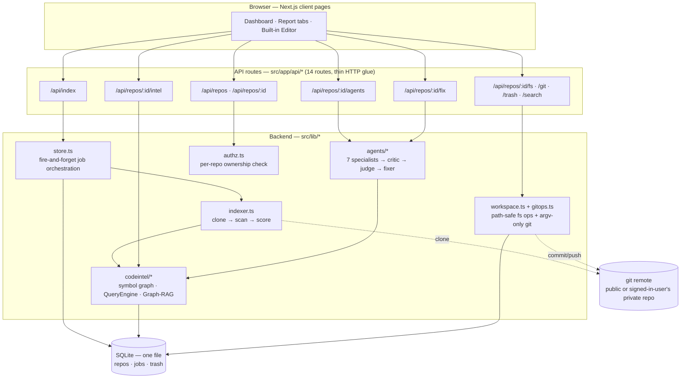

<div align="center">

# CodeGraph

**Turns a git repo into a symbol-level knowledge graph, then runs a deterministic swarm of specialist agents against it to find and verifiably fix real issues — no LLM API key required.**

[](https://github.com/archdex-art/CodeGraph/actions/workflows/ci.yml)
[](./LICENSE)
[](#requirements)

[Live demo](https://codegraph-8qqc.onrender.com) · [Quick start](#quick-start-2-minutes) · [Architecture](#architecture) · [Benchmarks](#benchmarks) · [Roadmap](#roadmap)

</div>

---

## This is a real, running product, not a design doc

Point it at a public repo (or sign in with GitHub to import your own) and it clones, builds a symbol-level knowledge graph, scores it, and gives you three visualizations, a queryable code-intelligence layer, a 7-agent remediation swarm with a sandboxed fixer, and a built-in Git-integrated editor — all in one Next.js app backed by a single SQLite file. No vector DB, no Postgres, no message queue, no LLM API key.

> **Note on `docs/archive/legacy-design/`:** an earlier, more ambitious Python/Postgres/NATS/Temporal design lives there. It was never built. Everything below describes what's actually running today.

## Try it now

**[codegraph-8qqc.onrender.com](https://codegraph-8qqc.onrender.com)** — live instance on Render's Starter tier (512MB/0.5 vCPU). First load after idle can take 20–30s to cold-start; it's fast once warm. Paste any public GitHub URL and watch it index.

---

## Architecture



**Request flow, in one line:** *Browser → API route → backend lib → SQLite*, with jobs run fire-and-forget in the same Node process (no external queue — see [Known constraints](./ARCHITECTURE.md#known-constraints-learned-the-hard-way--see-docspostmortems)). Full detail, including the security model: [`ARCHITECTURE.md`](./ARCHITECTURE.md).

### The agent swarm, specifically

```
runSwarm(repo)
  ├─ 1. SPECIALISTS (parallel, shared graph memory)
  │     Security · Performance · Refactor · Dead-code · Dependency · Architecture · Test
  ├─ 2. CRITIC    dedupe by locus + cross-corroborate (agreement raises confidence)
  ├─ 3. JUDGE     score = severity × log(blastRadius) × confidence × effortBonus → P0/P1/P2/P3
  └─ 4. FIXER     (optional) clone to a disposable sandbox → apply a safe codemod →
                  RE-INDEX and require score not-regressed → emit a real unified git diff
```

Every specialist is deterministic — no LLM call, no API key, no non-determinism between runs on the same repo.

---

## Quick start (2 minutes)

```bash
git clone https://github.com/archdex-art/CodeGraph.git
cd CodeGraph/app
npm install
npm run dev              # http://localhost:4000
```

Requires **Node ≥ 22** (uses the built-in `node:sqlite` — no native modules) and **`git`** on `PATH`.

Open `http://localhost:4000`, paste a public repo URL — e.g. `https://github.com/expressjs/express` — and hit **Start Indexing**. In well under a minute you get:
- A **Health Score** (0–100, blast-radius-weighted, explainable)
- Three visualizations: **Architecture** flowchart, zoomable **Circle-pack**, force-directed **Network**
- A **Code Intelligence** tab: symbol search, callers/callees, impact analysis, circular-dependency detection, dead-code, Graph-RAG context generation
- An **Agents** tab: run the swarm, get a ranked remediation plan, click **Generate verified fix PR** on any finding
- An **Editor** tab: full Git-integrated file browser + Monaco editor, commit/push, restorable trash

No sign-up, no API key, nothing to configure for this path.

## Installation & deployment

| Mode | Command | Notes |
|---|---|---|
| **Local dev** | `cd app && npm install && npm run dev` | Hot reload, `http://localhost:4000` |
| **Production (standalone Node)** | `npm run build && npm run start` | Emits `.next/standalone/server.js` |
| **Docker (recommended for prod)** | `cd app && docker compose up --build` | Multi-stage `node:24-slim` build; runs as root deliberately (see [`docs/postmortems/`](./docs/postmortems) for why) |
| **Render** | `render.yaml` at repo root | Blueprint deploy; persistent disk for SQLite + editor workspaces |

Optional features (both off by default, zero config needed if you don't want them):
- **HTTP Basic Auth gate** — set `CG_BASIC_AUTH_PASSWORD` to lock the whole app behind a shared password.
- **GitHub sign-in** — set `GITHUB_OAUTH_CLIENT_ID` / `GITHUB_OAUTH_CLIENT_SECRET` / `CG_SESSION_SECRET` to let users one-click import their own repos, including private ones.

Full env-var reference, OAuth App setup walkthrough, backup/restore, and scaling notes: **[`app/DEPLOY.md`](./app/DEPLOY.md)**.

---

## Benchmarks

Real numbers from real runs against real repos — not synthetic targets. Reproduce any of these yourself; the exact commands are in [`.github/workflows/ci.yml`](./.github/workflows/ci.yml) and the docs linked below.

| What | Result | Source |
|---|---|---|
| **Symbol graph extraction** (`expressjs/express`) | 123 symbols, 94 edges, 94 resolved calls; 14 real call cycles found; 49 unreferenced functions flagged | [`app/CODE_INTELLIGENCE.md`](./app/CODE_INTELLIGENCE.md) |
| **Agent swarm** (`expressjs/express`, live) | 69 findings across 6 active specialists (P0:10 · P1:18 · P2:39 · P3:2); projected Health Score **90 → 100** after fixing P0+P1 | [`app/AGENTS.md`](./app/AGENTS.md) |
| **Verified remediation** (`expressjs/express`, live) | 31 real fixes applied across 27 files; Health Score **90 → 93** (actual re-index, not projected), issues **53 → 29**; valid, applyable unified git diff | [`app/AGENTS.md`](./app/AGENTS.md) |
| **Graph-RAG context generation** | Query *"render a view template"* → 5 seeds, 11 slices, ~647 tokens, structured prompt | [`app/CODE_INTELLIGENCE.md`](./app/CODE_INTELLIGENCE.md) |
| **Memory ceiling under Render's real constraints** | Full pipeline survives indexing `octocat/Hello-World` **and** `expressjs/express` end-to-end inside a container capped at `--memory=512m --cpus=0.5` — the exact config that OOM-killed the server before the fix in [`docs/postmortems/2026-07-10-tree-sitter-oom.md`](./docs/postmortems/2026-07-10-tree-sitter-oom.md) | CI `docker-smoke-test` job, runs on every push |
| **Test suite** | 96/96 passing across 6 files (security, indexer, codeintel, executor, layout, tenant-isolation) | `npm run test` |
| **Security posture (self-audited, tracked openly)** | Baseline **3/10 → 8/10** after Phase 0–3 hardening (SSRF guard, local-access gate, security headers, auth gate, cross-tenant isolation fix). A follow-up deep audit found **99 further issues (5 critical)** across the full stack, mostly *not yet fixed* — see [Known issues](#known-issues--security-status) below | [`docs/PROGRESS_TRACKER.md`](./docs/PROGRESS_TRACKER.md), [`docs/AUDIT_2026-07-12.md`](./docs/AUDIT_2026-07-12.md) |

## Comparison with existing tools

| | **CodeGraph** | Sourcegraph / enterprise code search | "Chat with your codebase" (vector-RAG) tools | GitHub code search |
|---|---|---|---|---|
| Structure model | Symbol-level graph (functions/classes/calls, resolved) | Symbol index + search, strong for large orgs | Flat text-chunk embeddings, no persistent graph | Text/regex, no semantic graph |
| Remediation | Deterministic 7-agent swarm → ranked plan → sandboxed, **re-index-verified** fix diffs | None built-in (search/navigation tool) | Suggests fixes via LLM, unverified | None |
| LLM dependency | **None** for indexing, scoring, or the agent swarm | N/A | Required (embeddings + generation) | N/A |
| Self-host footprint | One container, one SQLite file, no queue/vector-DB | Multi-service, database-heavy | Usually needs a vector DB + LLM API | N/A (hosted only) |
| Built-in editor | Yes — Monaco + Git integration, commit/push from the UI | No | No | No |
| Best for | Solo devs/small teams wanting a self-hostable, no-API-key health check + guided remediation | Large orgs needing cross-repo enterprise search at scale | Ad-hoc Q&A over a codebase | Finding text across public GitHub |

CodeGraph doesn't compete on search-at-scale (Sourcegraph's actual strength) or open-ended Q&A (what embedding-based tools are for) — its bet is a persistent, typed, queryable structure that a *deterministic* agent pipeline can reason over and verify against, without paying for or depending on an LLM to do it.

---

## Roadmap

Tracked live in [`docs/IMPROVEMENT_PLAN.md`](./docs/IMPROVEMENT_PLAN.md) (the plan) and [`docs/PROGRESS_TRACKER.md`](./docs/PROGRESS_TRACKER.md) (the actual status against it) — not aspirational, checked off as it happens.

- [x] **Phase 0 — Security lockdown**: SSRF guard, local-access gate, security headers, opt-in auth gate
- [x] **Phase 1 — Reliability guardrails**: CI (typecheck + tests + adversarial Docker smoke test), branch protection, 4 incident postmortems
- [x] **Phase 2 — Test coverage**: 96 regression tests locking the security/reliability fixes
- [x] **Phase 3 — Documentation cleanup**: this README, `ARCHITECTURE.md`, legacy docs archived
- [x] **Phase 0.6 — Multi-tenant isolation** *(pulled forward, was live-severity)*: per-repo ownership, cross-tenant data leak closed
- [ ] **Phase 4 — Close the agent loop** *(next up)*: real PR creation (branch → commit → push → open PR via GitHub API) from a verified fix, with an explicit confirmation gate and a visible audit trail
- [ ] **Phase 5 — Scale & domains** *(stretch)*: a second Tree-sitter language extractor (Python) for AST-grade precision beyond regex, runtime/observability domain (OTel ingestion)

### Known issues / security status
This project audits itself and publishes the results rather than hiding them. A comprehensive follow-up audit ([`docs/AUDIT_2026-07-12.md`](./docs/AUDIT_2026-07-12.md)) found **99 issues (5 critical, 24 high)** beyond what Phases 0–3 already fixed — including a confused-deputy token-relay path in the fix executor and two symlink-escape vectors. These are **tracked, not silently patched over**; fixing them is the next priority ahead of Phase 4. If you're evaluating this for anything beyond local/trusted-host use, read that audit first.

---

## Contributing

1. Fork, branch, make your change.
2. Before opening a PR, run what CI runs — it's the same three commands, no surprises:
   ```bash
   cd app
   npx tsc --noEmit -p tsconfig.json   # typecheck
   npm run test                         # vitest, must stay green
   npm run build                        # production build must succeed
   ```
3. `main` is branch-protected — both CI jobs (`Test & Build`, `Docker build + adversarial smoke test`) must pass before a PR can merge.
4. New security-relevant code needs a regression test in the same PR (see `app/tests/tenant-isolation.test.ts` for the expected style: real scenarios, not mocked-away assertions).
5. Docs live next to what they describe (`app/*.md` for product detail, root `ARCHITECTURE.md` for the system as a whole) — update the relevant one alongside a behavioral change, not after.

Found a security issue? Please open an issue rather than a public PR with exploit details until it's triaged.

## License

[MIT](./LICENSE) — use it, fork it, ship it, sell it. No warranty.
