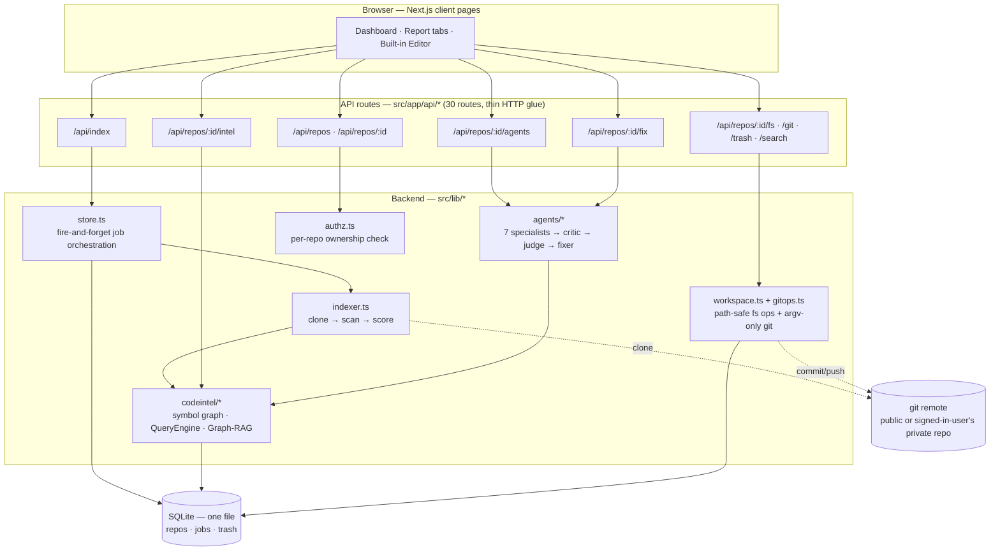

<div align="center">

# CodeGraph

**Turns a git repo into a symbol-level knowledge graph, then runs a deterministic swarm of specialist agents against it to find and verifiably fix real issues — no LLM API key required.**

[](https://github.com/archdex-art/CodeGraph/actions/workflows/ci.yml)
[](./LICENSE)
[](#requirements)

[Live demo](https://codegraph-8qqc.onrender.com) · [Quick start](#quick-start-2-minutes) · [Architecture](#architecture) · [Benchmarks](#benchmarks) · [Roadmap](#roadmap)

</div>

---

## This is a real, running product, not a design doc

Point it at a public repo (or sign in with GitHub to import your own) and it clones, builds a symbol-level knowledge graph, scores it, and gives you three visualizations, a queryable code-intelligence layer, a 7-agent remediation swarm with a sandboxed fixer, and a built-in Git-integrated editor — all in one Next.js app backed by a single SQLite file. No vector DB, no Postgres, no message queue, no LLM API key.

> **Note on `docs/archive/legacy-design/`:** an earlier, more ambitious Python/Postgres/NATS/Temporal design lives there. It was never built. Everything below describes what's actually running today.

## Try it now

**[codegraph-8qqc.onrender.com](https://codegraph-8qqc.onrender.com)** — live instance on Render's Starter tier (512MB/0.5 vCPU). First load after idle can take 20–30s to cold-start; it's fast once warm. Paste any public GitHub URL and watch it index.

---

## Architecture


```mermaid
flowchart TB
    subgraph Client["Browser — Next.js client pages"]
        UI["Dashboard · Report tabs · Built-in Editor"]
    end

    subgraph API["API routes — src/app/api/* (30 routes, thin HTTP glue)"]
        IDX["/api/index"]
        REPOS["/api/repos · /api/repos/:id"]
        INTEL["/api/repos/:id/intel"]
        AGENTS["/api/repos/:id/agents"]
        FIX["/api/repos/:id/fix"]
        FS["/api/repos/:id/fs · /git · /trash · /search"]
    end

    subgraph Core["Backend — src/lib/*"]
        STORE["store.ts<br/>fire-and-forget job orchestration"]
        INDEXER["indexer.ts<br/>clone → scan → score"]
        CODEINTEL["codeintel/*<br/>symbol graph · QueryEngine · Graph-RAG"]
        SWARM["agents/*<br/>7 specialists → critic → judge → fixer"]
        WORKSPACE["workspace.ts + gitops.ts<br/>path-safe fs ops + argv-only git"]
        AUTHZ["authz.ts<br/>per-repo ownership check"]
    end

    DB[("SQLite — one file<br/>repos · jobs · trash")]
    GITREMOTE[("git remote<br/>public or signed-in-user's private repo")]

    UI --> IDX & REPOS & INTEL & AGENTS & FIX & FS
    IDX --> STORE
    STORE --> INDEXER --> CODEINTEL
    INTEL --> CODEINTEL
    AGENTS --> SWARM --> CODEINTEL
    FIX --> SWARM
    FS --> WORKSPACE
    REPOS --> AUTHZ
    STORE --> DB
    CODEINTEL --> DB
    WORKSPACE --> DB
    INDEXER -.clone.-> GITREMOTE
    WORKSPACE -.commit/push.-> GITREMOTE
```

**Request flow, in one line:** *Browser → API route → SQLite-backed job queue → worker process → SQLite*. Analysis runs in a **separate `apps/worker` process** that spawns a child per job, not inline in the web server — that is what keeps `web-tree-sitter`'s ever-growing WASM heap from OOM-killing a 512 MB host ([ADR-001](./docs/design/HLD.md), [postmortem](./docs/postmortems/2026-07-10-tree-sitter-oom.md)). Still one container and one SQLite file: the queue is a table, not a broker. `npm run dev` analyses inline for convenience; the shipped image sets `CG_USE_WORKER=true`. Full detail, including the security model: [`ARCHITECTURE.md`](./ARCHITECTURE.md).

### The agent swarm, specifically

```
runSwarm(repo)
  ├─ 1. SPECIALISTS (parallel, shared graph memory)
  │     Security · Performance · Refactor · Dead-code · Dependency · Architecture · Test
  ├─ 2. CRITIC    dedupe by locus + cross-corroborate (agreement raises confidence)
  ├─ 3. JUDGE     score = severity × log(blastRadius) × confidence × effortBonus → P0/P1/P2/P3
  └─ 4. FIXER     (optional) clone to a disposable sandbox → apply a safe codemod →
                  RE-INDEX and require score not-regressed → emit a real unified git diff
```

Every specialist is deterministic — no LLM call, no API key, no non-determinism between runs on the same repo.

---

## Quick start (2 minutes)

```bash
git clone https://github.com/archdex-art/CodeGraph.git
cd CodeGraph
npm install              # one lockfile for the whole workspace
npm run dev              # http://localhost:4000
```

Requires **Node ≥ 22** (uses the built-in `node:sqlite` — no native modules) and **`git`** on
`PATH`. Run from the repository root, not from a package: `npm install` resolves every workspace
from the single root lockfile.

> Analysis runs **in the web process** by default, so that one command is the whole app. The
> separate worker (`npm run dev:worker`, with `CG_USE_WORKER=true`) exists for getting indexing
> off the request path; leaving it off is the supported path and needs no second terminal.

Open `http://localhost:4000`, paste a public repo URL — e.g. `https://github.com/expressjs/express` — and hit **Index**. In well under a minute you get:
- A **Health Score** (0–100, blast-radius-weighted, explainable) — this is **defect risk**: *how likely is this code to break?* Maintainability and performance risk are reported beside it and never averaged in, so a tidy codebase cannot flatter a fragile one. The score also states the coverage it was computed over, because one measured across 55% of files is a different claim from one across 98%
- Three visualizations: **Architecture** flowchart, zoomable **Circle-pack**, force-directed **Network**
- A **Code Intelligence** tab: symbol search, callers/callees, impact analysis, circular-dependency detection, dead-code, Graph-RAG context generation
- An **Agents** tab: run the swarm, get a ranked remediation plan, click **Generate verified fix PR** on any finding
- An **Editor** tab: full Git-integrated file browser + Monaco editor, commit/push, restorable trash, optional AI Assistant chat panel (Claude or your own local model)

No sign-up, no API key, nothing to configure for this path.

**Feature status.** Not everything here is equally finished, and the difference is worth stating
rather than leaving you to discover it:

| Area | Status | What that means |
|---|---|---|
| Indexing · graph · Health Score · Code Intelligence | **stable** | Covered by tests, exercised on every push by the Docker smoke test |
| Agent swarm · verified remediation · Editor | **stable** | Same, with the verification limits spelled out in the CLI section above |
| CLI (`codegraph fix`) | **beta** | One command. Works and is tested end to end, but `index` and `score` do not exist yet, so it is a remediation tool rather than the whole workbench |
| Fleet · Timeline | **experimental** | Useful, thinner test coverage, and the API may change without ceremony |

### The CLI — where `verified` means the most

```bash
node apps/cli/bin.mjs fix . --verify
```

Gate 3 of verification runs **your** test suite, and that needs an isolated container. A hosted
instance cannot provide one, so it reports `verified: partial` and says so. On your machine —
your toolchain, your dependencies, your call on isolation — it reports `verified: full`.

```
Applied 3 edit(s) across 1 file(s)
Health  85 → 93   5 → 2 issues

Verification: full
  ✓ syntax     0ms — 1 file(s) re-parsed
  − types      0ms — no tsconfig.json in the project
  ✓ tests      205ms — npm test --silent
  ✓ reanalysis 186ms — no new findings introduced; no target finding was named, so this
                       does not prove a specific finding was fixed
```

That last line is the tool refusing to overstate: a batch run cannot attribute an edit to one
finding, so it verifies "nothing new broke" and says so rather than implying more. Fix a single
finding from the UI and gate 4 makes the stronger claim — that *this* finding's fingerprint is
gone.

Your source is never modified: the work happens in a temp copy and you get a unified diff to
pipe into `git apply`. The exit code is the verdict, so it works as a pre-commit hook — `0` for
verified, `1` for a gate that rejected the patch.

`--rule <id>` narrows to one rule, `--file <path>` to one file, `--json` for machine output.

### CI — fail a change on findings, not on a score

A score threshold fails a pull request for debt its author did not write. `codegraph ci` gates on
**unaccepted findings at or above a confidence tier**, each carrying one line of evidence you can
check without opening the file. The exit code is the verdict.

```bash
node apps/cli/bin.mjs ci . --fail-on high --sarif codegraph.sarif --json codegraph-summary.json
```

```
Health     77/100   /path/to/repo
Findings   200 active · 0 accepted
Tiers      high 73 · medium 10 · low 117

Top rules
  99  security/detect-non-literal-fs-filename       low
  36  hardcoded-local-url                           high
  19  hardcoded-secret                              high

Gate       --fail-on high
  ✗ apps/web/tests/security.test.ts:222  hardcoded-secret high
      assigned to `PASSWORD`, 6 chars, generated-looking

FAIL — 73 unaccepted finding(s) at or above high confidence.
```

Adopting it on a codebase that already has findings does not require a thousand-line PR:

```bash
node apps/cli/bin.mjs baseline .     # 3 entries accepting 7 finding(s)
node apps/cli/bin.mjs ci .           # exit 0 — the gate now fires on what you add next
```

A baseline entry is *rule + file*, deliberately not line — a line-keyed baseline expires on the
next commit that adds an import. Accepted findings are **still reported**: they stay in the
summary, they stay in the SARIF marked `suppressions: external` (code scanning shows them as
dismissed), and they stay out of the Health Score. A baseline that makes findings vanish is an
allowlist nobody reviews. `codegraph-ignore <rule> — reason` on the offending line is the
per-finding escape hatch.

#### In GitHub Actions

`action.yml` at the repo root is a composite action: it runs the gate, writes SARIF, and uploads
it with `github/codeql-action/upload-sarif@v3`.

```yaml
permissions:
  contents: read
  security-events: write   # SARIF upload
  pull-requests: write     # the summary comment

steps:
  - uses: actions/checkout@v4
  - uses: archdex-art/CodeGraph@main
    with:
      path: "."
      fail-on: high
      sarif: codegraph.sarif
```

`.github/workflows/codegraph.yml` is this repository dogfooding it, and adds one **sticky** PR
comment — found and updated by a hidden HTML marker, so a ten-push PR has one comment with
current numbers rather than ten comments with stale ones. It carries the score, the tier counts,
the top five gating findings with `file:line`, rule id and evidence, and how many findings the
baseline accepted.

## Installation & deployment

| Mode | Command | Notes |
|---|---|---|
| **Local dev** | `npm ci && npm run dev` | Repo root. Hot reload, `http://localhost:4000` |
| **Production (standalone Node)** | `npm ci && npm run build && npm run start` | Emits `apps/web/.next/standalone/apps/web/server.js` |
| **Docker (recommended for prod)** | `docker compose up --build` | Repo root — the build context is the whole workspace. Multi-stage `node:24-slim`; runs as root deliberately (see [`docs/postmortems/`](./docs/postmortems) for why) |
| **Render** | `render.yaml` at repo root | Blueprint deploy; persistent disk for SQLite + editor workspaces |

Optional features (all off by default, zero config needed if you don't want them):
- **HTTP Basic Auth gate** — set `CG_BASIC_AUTH_PASSWORD` to lock the whole app behind a shared password.
- **GitHub sign-in** — set `GITHUB_OAUTH_CLIENT_ID` / `GITHUB_OAUTH_CLIENT_SECRET` / `CG_SESSION_SECRET` to let users one-click import their own repos, including private ones.
- **Owner-only lockdown** — with GitHub sign-in configured, additionally set `CG_OWNER_GITHUB_LOGIN` (your GitHub username, or a comma-separated list) to restrict the *entire* app — every page and API route, including the normally-anonymous public bucket — to just that account. Enforced once in `apps/web/src/proxy.ts`.
- **AI Assistant in the Editor** — set `ANTHROPIC_API_KEY` for a Claude-powered chat panel, and/or `CG_LOCAL_LLM_BASE_URL` + `CG_LOCAL_LLM_MODEL` to point it at your own OpenAI-compatible local model server (Ollama, LM Studio, llama.cpp, vLLM, ...) instead — no data leaves your machine either way you choose the local backend. Either backend gets read/write/search/git on the open repo's workspace, no shell access — see `apps/web/AGENTS.md`. Claude is the only piece of CodeGraph that calls a hosted LLM; everything else, including the agent swarm above and the local-model backend, needs none.

Full env-var reference, OAuth App setup walkthrough, backup/restore, and scaling notes: **[`apps/web/DEPLOY.md`](./apps/web/DEPLOY.md)**.

---

## Benchmarks

Real numbers from real runs against real repos — not synthetic targets.

Every repo-dependent row below is pinned to the exact commit it was measured against, because these
numbers move when the target repo moves — and, as it turns out, when *ours* does.

Re-measured 2026-07-30 with `npm run bench`, which reproduces every figure in this table from a
fresh clone. Three had drifted since the last pass, all because the product changed rather than the
target: the Health Score moved 77 → 74 when the score was split into pillars (defect risk is now
surfaced alone) and then 74 → 77 again when `confidence` entered the kernel — the same figure
twice, for unrelated reasons, which is precisely why every row cites a pinned commit and a command
rather than a remembered number. The priority buckets moved from `P0:21 · P1:38 · P2:0` to
`P0:8 · P1:16 · P2:35` when judge calibration was fixed — the table used to describe that empty P2
as a known calibration issue, long after it was closed. The fix count (31 across 27 files) and
issue counts (87 → 56) were unchanged.

That is the whole argument for `npm run bench` existing: numbers nobody can re-derive go stale
quietly, and a README is the last place that should happen.

| What | Result | Source |
|---|---|---|
| **Symbol graph extraction** (`expressjs/express@a371447`) | 174 symbols across 159 files plus 112 synthetic module nodes; **301 resolved call edges**, up from 38 — 5 of them self-edges, which the graph used to mis-attribute to module scope. Symbols with no inbound edge: **73 of 174 (42%)**, down from 155 (89%). Two defects caused that: call-site attribution required a named enclosing function, discarding 46% of already-resolved calls, and the extractor recorded only `CallExpression`, so rendering a component or passing a callback produced no reference. Precision is measured separately against the TypeScript checker as ground truth — **98.4%** over 2,159 calls where both resolvers answered. Of the symbols still unreferenced on *this* repository, the compiler finds a real call site for only **2%**: the rest are exports, entry points and framework callbacks, which is the honest ceiling for a resolver with no runtime information | `npm run bench` |
| **Agent swarm** (`expressjs/express@a371447`) | 54 findings after the critic dedupes, across **7 of 7 active specialists** (P0:21 · P1:1 · P2:24 · P3:8); Health Score 89, *simulated* **89 → 90** if P0+P1 are fixed. The architecture specialist reported 0 here until the recursion fix above — express's 5 self-recursive functions were real call cycles the graph could not see. The projection re-runs the real scorer over the issues that would remain, so it simulates the shipped model rather than estimating — but it is a simulation, not a measurement | `npm run bench` |
| **Batch remediation** (`expressjs/express@a371447`) | **0 edits.** The batch fixer ships exactly one codemod — `annotate-empty-catch` — and express contains no empty catch block, so there is nothing for it to patch and it says so rather than manufacturing a diff. Two earlier codemods (`remove-debug-output`, `remove-todo-marker`) were deleted after one deleted a CLI script's only output line; the bar in `remediate-engine/src/types.ts` is that a fix cannot change behaviour AND must remove an issue the scorer counts, and nothing else has cleared it yet. This row published "31 fixes, 89 → 96" for a while after those removals — a stale number is exactly what `npm run bench` exists to catch, and it only catches it when someone runs it | `npm run bench` |
| **Graph-RAG context generation** | Query *"render a view template"* → 5 seeds, 11 slices, ~647 tokens, structured prompt | [`apps/web/CODE_INTELLIGENCE.md`](./apps/web/CODE_INTELLIGENCE.md) |
| **Memory ceiling under Render's real constraints** | Full pipeline survives indexing `octocat/Hello-World` **and** `expressjs/express` end-to-end inside a container capped at `--memory=512m --cpus=0.5` — the exact config that OOM-killed the server before the fix in [`docs/postmortems/2026-07-10-tree-sitter-oom.md`](./docs/postmortems/2026-07-10-tree-sitter-oom.md) | CI `docker-smoke-test` job, runs on every push |
| **Test suite** | **120 test files** in the workspace (security, indexer, scoring, pillars, coverage, dependencies, codeintel, graph scope, wheel-zoom policy, anonymous-indexing consent, incremental indexing, executor, verify gates, orchestrator, specialists, migrations, tenant-isolation, workspace containment, timeline hash validation, clone redirect refusal, ask recall, dashboard triage, CLI, README claims, and more). 2,206 cases as of 2026-08-09 — the file count is asserted by a test, the case count is a point-in-time figure that moves with every commit | `npm run test` |
| **Security posture (self-audited, tracked openly)** | Baseline **3/10 → 9.1/10**. Phases 0–3 hardening (SSRF guard, local-access gate, security headers, auth gate, cross-tenant isolation fix), then Phase 7 closed **17 of 27** findings from a follow-up deep audit that surfaced **99 issues (5 critical)** across the full stack. Remaining items are tracked, not hidden — plus an independent pen-test pass that verified every control live and fixed a rate-limit `X-Forwarded-For` bypass | [`docs/PROGRESS_TRACKER.md`](./docs/PROGRESS_TRACKER.md), [`docs/AUDIT_2026-07-12.md`](./docs/AUDIT_2026-07-12.md) |

## Comparison with existing tools

| | **CodeGraph** | Sourcegraph / enterprise code search | "Chat with your codebase" (vector-RAG) tools | GitHub code search |
|---|---|---|---|---|
| Structure model | Symbol-level graph (functions/classes/calls, resolved) | Symbol index + search, strong for large orgs | Flat text-chunk embeddings, no persistent graph | Text/regex, no semantic graph |
| Remediation | Deterministic 7-agent swarm → ranked plan → sandboxed, **re-index-verified** fix diffs | None built-in (search/navigation tool) | Suggests fixes via LLM, unverified | None |
| LLM dependency | **None** for indexing, scoring, or the agent swarm | N/A | Required (embeddings + generation) | N/A |
| Self-host footprint | One container, one SQLite file, no queue/vector-DB | Multi-service, database-heavy | Usually needs a vector DB + LLM API | N/A (hosted only) |
| Built-in editor | Yes — Monaco + Git integration, commit/push from the UI | No | No | No |
| Best for | Solo devs/small teams wanting a self-hostable, no-API-key health check + guided remediation | Large orgs needing cross-repo enterprise search at scale | Ad-hoc Q&A over a codebase | Finding text across public GitHub |

CodeGraph doesn't compete on search-at-scale (Sourcegraph's actual strength) or open-ended Q&A (what embedding-based tools are for) — its bet is a persistent, typed, queryable structure that a *deterministic* agent pipeline can reason over and verify against, without paying for or depending on an LLM to do it.

---

## Roadmap

Tracked live in [`docs/IMPROVEMENT_PLAN.md`](./docs/IMPROVEMENT_PLAN.md) (the plan) and [`docs/PROGRESS_TRACKER.md`](./docs/PROGRESS_TRACKER.md) (the actual status against it) — not aspirational, checked off as it happens.

- [x] **Phase 0 — Security lockdown**: SSRF guard, local-access gate, security headers, opt-in auth gate
- [x] **Phase 1 — Reliability guardrails**: CI (typecheck + tests + adversarial Docker smoke test), branch protection, 4 incident postmortems
- [x] **Phase 2 — Test coverage**: 265 regression tests locking the security/reliability/accuracy fixes
- [x] **Phase 3 — Documentation cleanup**: this README, `ARCHITECTURE.md`, legacy docs archived
- [x] **Phase 0.6 — Multi-tenant isolation** *(pulled forward, was live-severity)*: per-repo ownership, cross-tenant data leak closed
- [~] **Phase 4 — Close the agent loop** *(partly shipped)*: the **explicit confirmation gate exists** — every remote mutation now requires `PublishConsent { confirmed: true }`, and no route constructs one, so nothing publishes as shipped. What remains is the endpoint that takes that consent and performs the branch → commit → push → PR, plus the audit trail
- [ ] **Phase 5 — Scale & domains** *(stretch)*: a second Tree-sitter language extractor (Python) for AST-grade precision beyond regex, runtime/observability domain (OTel ingestion)
- [x] **Phase 6 — Code-intelligence breadth**: ownership (developer → commit → file → symbol, reviewer recommendation, stale/orphaned areas), APIs as first-class graph entities with endpoint → service → sink flow tracing, inter-procedural taint, dependency advisories (OSV, opt-in), unused-dependency and replacement-impact analysis, PR intelligence over a real diff, and a cross-repository organisational graph — see the table below for what each does and does not know

### What the intelligence layer actually knows

Each row is reachable from a route and covered by tests. The **limits** column is the point: every analysis here reports what it could not determine instead of defaulting to a clean answer, because "we did not look" and "there is nothing there" are different claims.

| Capability | Route | Limits it states about itself |
|---|---|---|
| **Ownership** — authors, per-file shares, bus factor, stale/orphaned areas, symbol-level attribution | `/api/repos/:id/ownership?op=summary\|file\|reviewers\|familiarity` | Shares are of COMMITS, not lines. Symbol attribution intersects historical hunks with CURRENT spans, so a symbol that moved is matched where it is now |
| **Reviewer recommendation** — ownership × recency × co-change | same route, `op=reviewers` | Excludes anyone inactive in the window; each recommendation carries the evidence it was derived from. No history → no recommendation, not a guess |
| **API entities + data flow** — endpoints as graph nodes, endpoint → service → database/fs/network/process flows | `/api/repos/:id/intel?op=endpoints\|flows\|api-impact\|unauth-paths` | `authenticated` is three-valued: `null` means the handler could not be resolved, and only `false` (resolved, no guard) reaches `unauth-paths` |
| **Inter-procedural taint** — untrusted values followed argument-index to parameter-index across calls | `/api/repos/:id/intel?op=taint` | Cannot see aliasing, collections, dynamic dispatch or unresolved cross-module calls. Confidence is derived from edge resolution and chain length. Defended paths are reported as `sanitized`, not dropped |
| **Dependency advisories** — OSV lookup | `/api/repos/:id/dependencies?op=advisories` | **Off by default** (`CG_ENABLE_ADVISORY_LOOKUP`): indexing runs on strangers' repos. Status is `checked` / `unavailable` / `disabled`; only `checked` licenses a conclusion. npm only |
| **Unused / replaceable dependencies** | `/api/repos/:id/dependencies?op=unused\|impact` | Candidates with a confidence and a caveat, never verdicts. Types-only packages, script-invoked CLIs, config-loaded plugins and peer deps are excluded or downgraded by name |
| **PR intelligence** — changed symbols, affected endpoints and DB models, blast radius, relevant tests, reviewers, risk | `/api/repos/:id/pr?base=&head=` | Joined against the LAST index, not `head`. Risk is a weighted sum whose every term is published with its evidence — it ranks, it does not predict |
| **Organisational graph** — cross-repo dependencies, shared libraries, repo cycles, contributors | `/api/org` | An edge is drawn only when one repo's manifest declares the name another depends on. Repos that cannot contribute are listed in `excluded` with a reason |

### Known issues / security status
This project audits itself and publishes the results rather than hiding them. A comprehensive follow-up audit ([`docs/AUDIT_2026-07-12.md`](./docs/AUDIT_2026-07-12.md)) found **99 issues (5 critical, 24 high)** beyond what Phases 0–3 already fixed — including a confused-deputy token-relay path in the fix executor and two symlink-escape vectors. **Phase 7 has since closed all 5 criticals and 17 of 27 security findings** (symlink-escape fixes, credential redaction, job-ownership checks, OAuth open-redirect guard, session expiry, rate limiting, and more — each with regression tests), and an independent pen-test pass verified the controls live. The remaining items are testing-debt or deliberate product/infra tradeoffs, all **tracked in the open** ([`docs/PROGRESS_TRACKER.md`](./docs/PROGRESS_TRACKER.md)), not silently patched over. If you're evaluating this for anything beyond local/trusted-host use, read that audit first.

---

## Contributing

1. Fork, branch, make your change.
2. Before opening a PR, run what CI runs — from the repo root, not from `apps/web`:
   ```bash
   npm ci                # never `npm install` at the root; see CLAUDE.md
   npm run typecheck     # every workspace
   npm run depcruise     # HLD §6.1 layering + cycle gate
   npm run test          # vitest, must stay green
   npm run build         # production build must succeed
   ```
3. `main` is branch-protected — both CI jobs (`Test & Build`, `Docker build + adversarial smoke test`) must pass before a PR can merge.
4. New security-relevant code needs a regression test in the same PR (see `apps/web/tests/tenant-isolation.test.ts` for the expected style: real scenarios, not mocked-away assertions).
5. Docs live next to what they describe (`apps/web/*.md` for product detail, root `ARCHITECTURE.md` for the system as a whole) — update the relevant one alongside a behavioral change, not after.

Found a security issue? Please open an issue rather than a public PR with exploit details until it's triaged.

## License

[MIT](./LICENSE) — use it, fork it, ship it, sell it. No warranty.
