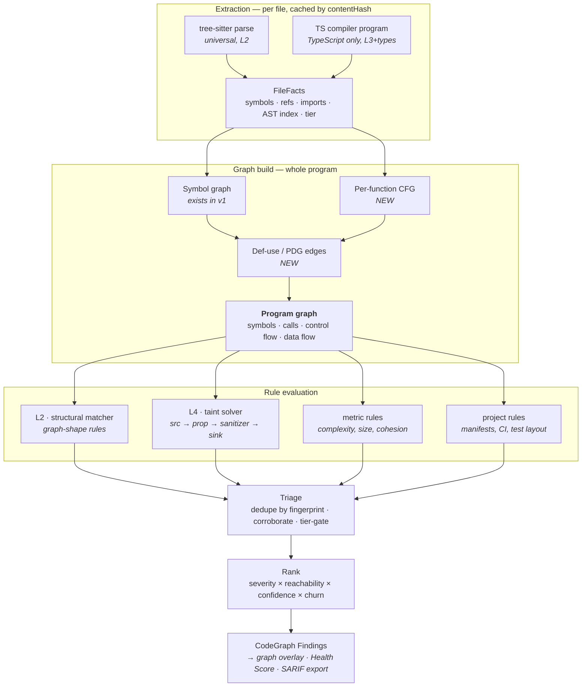

# CodeGraph — Detection Engine: Research, Design, and Side-by-Side Comparison

| | |
|---|---|
| **Version** | 1.1 |
| **Date** | 2026-07-29 |
| **Status** | Research + proposed design (ADR-003, ADR-004 in [`HLD.md`](./HLD.md)) |
| **Governed by** | [`IDENTITY.md`](./IDENTITY.md) — binding |
| **Question this answers** | *Can CodeGraph's issue finding be made materially better than what it does today, and if so, how — concretely?* |

**Short answer: yes, by roughly an order of magnitude in precision, and the technique is
well-established.** The current detector sits on the lowest rung of a well-understood ladder of
analysis power. Climbing two rungs — to structural matching over the graph, then to dataflow
with sanitizers — captures most of the available gain, and it does so by *extending the symbol
graph CodeGraph already builds and already renders* rather than bolting on a second system.

This document establishes what the current detector can and cannot do, surveys how the field
solves the problem, designs the version CodeGraph should build, and compares old against new on
real code.

> **Scope note.** Detection is a lens on the graph, not the product
> ([`IDENTITY.md`](./IDENTITY.md) §4.6). The goal here is a detector good enough that the graph
> views, the Health Score, and the verified fix can all be trusted — not a scanner that competes
> on a findings leaderboard. Part 3 surveys other engines because their *techniques* are public
> knowledge worth learning from; their rule syntax, metric names, and positioning are not
> borrowed, and §5.3 explains what the work actually buys.

---

## Part 1 — What the current engine actually does

Precision matters here, so: mechanics, not summary.

### 1.1 The detection loop

`app/src/lib/indexer.ts:383-420`:

```ts
const lines = f.text.split("\n");
for (const rule of RULES) {
  let hits = 0;
  for (let i = 0; i < lines.length; i++) {
    const m = rule.re.exec(lines[i]);              // ← ONE LINE at a time
    if (m && (!rule.validate || rule.validate(lines[i], m))) {
      issues.push(mkIssue(rule.dimension, rule.severity, rule.title,
                          f.rel, i + 1, br, rule.confidence, ch));
      if (++hits >= 5) break;                      // ← cap
    }
  }
}
```

Twelve regexes (`indexer.ts:359-377`), each applied line-by-line to raw text, with no
knowledge of syntax, scope, types, or control flow. Plus `eslint-plugin-security` as a second
AST-based layer (`eslintSecurity.ts`) — the one genuinely structural detector present today.
Plus a shallow reachability pass in `specialists.ts:60` that connects a
`(req, res)`-shaped function to a security-flagged line via the call graph.

### 1.2 The ceiling, stated precisely

A line-scoped regex cannot, even in principle, know:

| Unknowable | Consequence |
|---|---|
| Whether the match is inside a string, comment, or template literal | `// don't use eval()` in a comment is a severity-5 security finding |
| Whether it spans lines | `db.query(\n  "SELECT " + x\n)` is invisible to the SQL rule |
| What the identifier resolves to | any `.query(` matches, whether it's a DB, a DOM selector, or a GraphQL client |
| Whether input was sanitised | `db.query(\`... ${escape(x)}\`)` is reported identically to the unsafe version |
| Whether the value is attacker-controlled | `eval(TRUSTED_CONSTANT)` and `eval(req.body.x)` are the same severity |
| What type anything is | `:\s*any\b` matches `{ margin: any }` in a CSS-in-JS object |

These are not tuning problems. No regex refinement fixes them, because the information
required is not present in a single line of text. **This is the ceiling, and it is the reason
to change engines rather than change rules.**

### 1.3 Demonstrable false positives in the current ruleset

Each of these fires today against the shipped `RULES` array:

```js
// 1. Comment → severity 5 security finding
// SECURITY NOTE: never use eval() on user input.     → "Use of eval()" (sev 5)

// 2. String literal → severity 5 security finding
const HELP = "Set api_key = 'your-key-here' in .env"; // "Possible hardcoded secret"
// (the placeholder guard checks the VALUE, not whether the whole thing is a doc string)

// 3. Test fixture → severity 5
const SQL_INJECTION_EXAMPLE = "SELECT * FROM t WHERE id = " + userId;  // in a test file

// 4. CSS-in-JS → "Untyped `any`"
const style = { margin: any };                        // matches /:\s*any\b/

// 5. Correctly parameterised query, flagged anyway
db.query("SELECT * FROM users WHERE id = $1", [id]);  // no match, good
db.query(`SELECT * FROM users WHERE id = ${escapeId(id)}`);  // ← FLAGGED. It is safe.
```

### 1.4 Demonstrable false negatives

```js
// 1. Multi-line — invisible
const sql =
  "SELECT * FROM users WHERE name = '" +
  req.body.name + "'";
db.query(sql);                         // NOT DETECTED (no single line matches)

// 2. Indirection — invisible
const evil = eval;
evil(req.body.code);                   // NOT DETECTED

// 3. Cross-function taint — invisible to the regex, and to the shallow taint pass
//    unless the sink line ALSO independently matches a security regex
function handler(req, res) { process(req.body.tpl); }
function process(t) { res.send(render(t)); }   // XSS, no regex hit anywhere

// 4. Any vulnerability class without a syntactic signature:
//    IDOR, missing authz, race conditions, SSRF, path traversal,
//    prototype pollution, insecure deserialisation, ReDoS in a non-literal regex.
```

### 1.5 Scoring pathologies that compound the above

Three, from the review:

- **Blast radius is file-level** (`indexer.ts:392`): a `TODO` (sev 1) in a file imported 60×
  scores penalty 60; an `eval()` (sev 5) in a leaf file scores 5. The ranking inverts.
- **`hits >= 5` cap**: a file with 500 issues scores as one with 5.
- **`confidence` is stored and then ignored** by `score()` — a 0.7-confidence guess pushes the
  score exactly as hard as a 1.0-confidence fact.

---

## Part 2 — The ladder of detection power

Every static analyser sits at one of these levels. Cost and capability both rise; precision
rises with them, which is the point.

| Level | Technique | Sees | Example question it can answer | Representative tools |
|---|---|---|---|---|
| **L0** | Line regex | characters | "does the text `eval(` appear?" | grep, **CodeGraph v1** |
| **L1** | Token/lexical | tokens, comments, strings distinguished | "does `eval(` appear *in code*?" | basic linters |
| **L2** | AST / syntactic pattern | syntax shape | "is there a *call expression* whose callee is `eval`?" | ESLint, tree-sitter queries, Semgrep (OSS core) |
| **L3** | AST + symbol resolution | what names bind to | "is this `eval` the *global* `eval`, or a local variable?" | ESLint w/ scope analysis, TS compiler API |
| **L4** | Intraprocedural dataflow (CFG + def-use) | how values move in a function | "does the argument to `eval` derive from a parameter?" | Semgrep taint (intrafile), SonarQube, Infer |
| **L5** | Interprocedural dataflow / taint | how values move across functions | "does attacker input reach `eval` through 3 calls, unsanitised?" | CodeQL, Semgrep Pro, Joern, Fortify |
| **L6** | Path-sensitive / symbolic | which paths are feasible | "is the branch that reaches this sink actually reachable?" | Infer, KLEE, SonarQube SE engine |

**CodeGraph v1 is at L0**, with one L2 island (`eslint-plugin-security`) and a partial,
unusual L5 gesture (the `specialists.ts` taint pass) built on top of L0 findings — which means
its interprocedural reasoning inherits every L0 false positive underneath it.

**The proposal is to land squarely at L4, with bounded L5 for a small set of high-value rules.**
L6 is deliberately out of scope: path-sensitivity is where analysis cost explodes and where
the engineering effort stops paying for itself in a self-hostable tool.

---

## Part 3 — How the field solves this

*What follows is a technique survey, not a competitive analysis. Read it for the algorithms and
the decompositions — those are public knowledge and we use them freely. Do not read it for
vocabulary, rule syntax, metrics, or positioning; those belong to the products that built them
and are explicitly not adopted ([`IDENTITY.md`](./IDENTITY.md) §3).*

### 3.1 CodeQL — "code as data", queried in Datalog

GitHub's approach treats source as a **relational database**. An extractor parses the code and
emits TRAP files — a relational encoding of program facts: declarations, call edges, data-flow
relationships, type information. Queries are written in QL, an object-oriented extension of
Datalog, and run against that database.

The key architectural idea for our purposes is CodeQL's explicit separation of two related
analyses over one **data flow graph**:

- **Data flow** proper — tracks values where the value is *preserved* at each step (`x = y`).
- **Taint tracking** — extends data flow with steps where the value is *not* preserved but
  the influence is (`x = y + "suffix"`, `x = JSON.parse(y)`). Because derived values are still
  influenced by untrusted information, they are still tainted.

That distinction is what lets a taint analysis follow input through string concatenation,
parsing, and array indexing without either losing the trail (too strict) or flooding
(too loose). CodeQL also provides **flow labels/state** so a query can track *what kind* of
taint a value carries, distinguishing e.g. "raw user input" from "HTML-escaped user input"
along the same path.

**What we take:** the source/step/sink graph model, and the data-flow vs taint-tracking
distinction. **What we leave:** Datalog. A QL-class evaluator is a multi-year project, and
CodeQL's licence restricts non-open-source use — which would break the product's premise
(ADR-004).

### 3.2 Semgrep — patterns that look like the code they match

Semgrep's insight is ergonomic rather than theoretical: a rule should *look like the code it
matches*, with metavariables (`$X`) instead of AST node type names. `eval($X)` matches any
call to eval. That single decision is why Semgrep has thousands of community rules and CodeQL
has far fewer — the barrier to contributing one is a few lines of near-source.

Its taint mode (`mode: taint`) defines exactly four pattern categories, and this is the
cleanest published decomposition of the problem:

| Category | Role |
|---|---|
| **sources** | where untrusted data originates (`$REQ.body`) |
| **propagators** | patterns that carry taint forward (assignments, specific library calls) |
| **sinks** | dangerous destinations (`eval`, `db.query`, `res.send`) |
| **sanitizers** | patterns that mark data safe again (`escape(...)`, `parseInt(...)`) |

Taint analysis is intrafunction by default; **interprocedural and inter-file analysis are a
paid tier** (`--pro` with `interfile: true`), implemented by building a naming environment that
maps functions called in one file to their definitions in another, then running the dataflow
algorithm across that boundary. Semgrep has published that it cut taint analysis time by 75 %
through engine optimisation — a useful signal that this is the expensive stage.

**What we take:** the four-category taint spec, verbatim, as our rule DSL's vocabulary; and the
"patterns look like code" principle. **What we leave:** the engine itself — the capability we
most need (interfile) is exactly the part that is not open (ADR-004).

### 3.3 Joern / Code Property Graphs — one graph, three views

A **Code Property Graph** merges three classical representations into a single queryable
structure:

- **AST** — syntactic structure
- **CFG** — control flow: which statement can execute after which
- **PDG** — program dependence: which statements depend on which (data + control dependence)

Merged, they let a single traversal answer questions no individual representation can:
*"show me every path where user input reaches a database query without passing through a
sanitizer"* requires AST (to recognise the query call), CFG (to know a path exists), and PDG
(to know the data actually flows). Joern exposes this via CPGQL, a Scala-based traversal DSL.

**This is the single most directly applicable idea in the survey.** CodeGraph already has a
symbol graph with call edges — which is already a coarse slice of the same idea. **Adding a
per-function CFG and def-use edges turns CodeGraph's symbol graph into a full program graph**
and unlocks L4 immediately, reusing infrastructure that already exists and already has a UI. It is the highest-leverage architectural move available.

### 3.4 SonarQube — one idea worth learning from, one to leave alone

Sonar's detection engine is competitive but not distinctive. Its **SQALE** quality model is —
and it separates cleanly into a technique we should learn from and a presentation we must not
take.

SQALE quantifies technical debt as **the time to remediate**: every issue type carries an
estimated remediation cost in minutes; technical debt is their sum. The headline metric is a
ratio:

```
debtRatio = technicalDebt / (costToDevelopOneLine × LOC)      // default 30 min/line
```

…which Sonar then maps to an A–E letter grade.

**Learn from the ratio.** Two properties CodeGraph's current score lacks:

1. **It is interpretable in a unit humans reason about** (hours of work), not an opaque
   `100·exp(-k·penalty/sizeFactor)`.
2. **It is normalised defensibly** — against development cost, so a large codebase isn't
   automatically penalised for being large.

Per-finding remediation effort is therefore worth capturing (it is already `remediationMinutes`
in the rule model, §4.5) and worth surfacing as supporting detail.

> **Do not take the grades.** The A–E ladder is Sonar's dashboard, and adopting it would put
> their headline metric next to ours where a reader has to choose. **The Health Score is
> CodeGraph's number and it stands alone** — effort estimates are a column or a hover, never a
> letter, never a badge, never a gate. See [`IDENTITY.md`](./IDENTITY.md) §4.2.

The empirical literature on SAST tools is also worth stating plainly: comparative studies find
**no tool excels at everything**, that the OWASP Benchmark is widely used but unrepresentative
(synthetic, imbalanced) while the Juliet suite is more exhaustive, and that improving precision
without sacrificing recall remains an open research problem. This is the correct prior for
anyone building a detector: expect to trade, measure the trade, and publish it.

### 3.5 SCA reachability — the prioritisation lesson

Modern software-composition-analysis tools converged on one idea: **a vulnerability you cannot
reach is not a priority**. They build a call graph from application entry points down through
the dependency tree, and report only vulnerabilities whose vulnerable function is actually
reachable. Vendors report false-positive reductions on the order of 95 % from reachability
filtering alone, and combine it with exploitability signals — EPSS (predicted exploitation
likelihood) and CISA KEV (known-exploited) — to rank what remains.

**The lesson generalises beyond dependencies:** the ranking signal that matters is *reachability
from an entry point*, not *frequency of the pattern*. CodeGraph's `blastRadius` is trying to be
this and is currently measuring file import fan-in instead — the right idea, wrong graph, wrong
granularity.

### 3.6 tree-sitter — the right parser, with a known boundary

tree-sitter provides **incremental parsing** (re-parse only the edited region) and a
CSS-selector-like **query language** for matching patterns in the syntax tree. GitHub's own
static-analysis stage is built on it. CodeGraph already depends on `web-tree-sitter`.

Its boundary is equally clear: tree-sitter operates at the **syntax** level. It gives you L2
for free and L3 only with additional name-binding infrastructure layered on top; it does not
give you types. For TypeScript specifically, the TS compiler API gives L3 + types directly —
which is why the design uses tree-sitter as the universal baseline and the TS compiler as an
optional upgrade to `full` tier for the primary language.

### 3.7 SARIF — an export at the boundary

SARIF 2.1.0 has been an **OASIS Standard since 27 March 2020** (errata ratified 2023), designed
so results from multiple tools can be aggregated into common workflows. GitHub code scanning
ingests a subset of it natively.

Supporting it as an **export adapter** is nearly free and buys CI integration without custom
glue plus interoperability with whatever else a user already runs. That is worth having, and it
serves the user directly.

Reading its specification is also instructive: SARIF has first-class concepts for rules, code
flows (ordered taint traces), partial fingerprints, suppressions, and baselines, which is a
useful checklist of things a finding model has to handle. Learning from that checklist is fine.

> **It is not our internal model.** CodeGraph's `Finding` carries what *this product* needs —
> analysis tier, confidence basis, graph provenance, symbol identity — several of which have no
> natural SARIF home. If our internal type ever gets shaped by what an interchange format can
> express, CodeGraph has quietly become a commodity scanner with extra steps. Serialise outward
> at the boundary; never let the wire format reach inward. See [`IDENTITY.md`](./IDENTITY.md) §4.3.

---

## Part 4 — Proposed design: detection over CodeGraph's program graph

### 4.1 Design targets

| Target | Value |
|---|---|
| Detection level | **L4** universally; **bounded L5** (depth ≤ 3, exact-resolution edges only) for ~15 high-value security rules |
| Precision (curated benchmark) | ≥ 0.85 overall; ≥ 0.90 for rules that emit at P0 |
| Recall vs v1 | ≥ 2× on injection-class vulnerabilities |
| Added cold-run cost | ≤ 40 % over v1 |
| Warm (incremental) run | ≤ 5 % of cold |
| Rule authoring cost | one YAML file + two fixtures, no engine knowledge |

### 4.2 Architecture



### 4.3 Component 1 — the program graph

Extend the existing symbol graph with two additions:

```
existing:  Symbol --calls--> Symbol            (call graph)
NEW:       Statement --flows-to--> Statement   (CFG, per function)
NEW:       Def --used-by--> Use                (def-use chains, per function)
```

This is deliberately narrower than the research literature's full construction. It omits type
hierarchies, exception-flow edges, and pointer analysis. It contains exactly what an L4 taint solver needs and nothing more,
because every additional edge type is memory that must fit in 512 MB.

**Cost:** CFG construction is a single AST walk per function, ~O(nodes). Def-use over an SSA-ish
numbering is another. Both are linear and both are per-file cacheable.

### 4.4 Component 2 — structural matcher (L2/L3)

Rules match **graph shapes**, expressed in CodeGraph's own vocabulary — symbols, calls,
arguments, and the relations between them. Not a source-code-lookalike pattern language.

```yaml
match:
  call:
    callee: { name: eval, resolvesTo: global }   # not some local variable named `eval`
    argument: 0
```

The vocabulary is deliberately the one the Code Intelligence tab already exposes — `call`,
`callee`, `caller`, `symbol`, `argument`, `resolvesTo`, `reachableFrom`. A rule therefore reads
like a question you could have asked the graph by clicking, and anything a rule finds is
something you can then go look at in the graph views. That coherence is the point.

Constraints tighten as the tier allows: `resolvesTo` needs L3 name resolution, `type` needs
`full` tier. A rule declares its `minTier` and simply does not fire below it.

This layer alone eliminates every false positive in §1.3 — a comment is not a call node and a
string literal is not a call node, so neither can match.

> **Deliberately not adopted:** a code-shaped pattern syntax with metavariables (§3.2). It is
> ergonomically excellent and it is another product's signature. Copying it would make every
> rule file look like theirs and quietly tell contributors they are using a lesser version of
> something they already know. See [`IDENTITY.md`](./IDENTITY.md) §4.1.

### 4.5 Component 3 — taint solver (L4/L5)

A worklist dataflow analysis over the CFG. The four categories below — source, propagator,
sanitizer, sink — are the standard decomposition of taint analysis; they predate every tool in
Part 3 and belong to the field, not to any of them:

```
solveLocal(fn, spec):
  taint : Map<Variable, TaintState>            # forward, may-analysis
  worklist = [fn.cfg.entry]
  while worklist:
    node = pop()
    in  = ⊔ { out(pred) for pred in preds(node) }     # join at merge points
    out = transfer(node, in)
    if changed: push successors
  where transfer(node, state):
    if matches(node, spec.sources)    → taint the defined var, record step
    if matches(node, spec.sanitizers) → CLEAR taint on that var
    if matches(node, spec.propagators)→ propagate along def-use
    if matches(node, spec.sinks) and any operand tainted → EMIT TaintPath
```

Interprocedural (L5) extends this with a bounded summary approach: for each function, compute
a **summary** `{taintedParams} → {taintedReturns, taintedSideEffects}`, then propagate summaries
across `resolution: "exact"` call edges up to depth 3. Bounded depth is a deliberate precision
choice — the literature is clear that unbounded interprocedural taint without good sanitizer
modelling produces more noise than signal, and noise is what gets a scanner switched off.

**The sanitizer category is the single most important element here.** It is entirely absent from
v1, and it is the difference between reporting `db.query(\`... ${escapeId(id)}\`)` as a
critical SQL injection (v1 does) and correctly staying silent (v2 does).

### 4.6 Component 4 — evidence and confidence, made structural

Every finding carries `confidenceBasis` (LLD §2), and the basis is *derived from how the
finding was produced*, not hand-assigned by a rule author:

| Basis | Produced by | Base confidence |
|---|---|---|
| `syntactic` | regex/lexical tier match | 0.40 |
| `structural` | AST pattern match | 0.70 |
| `type_verified` | AST match + type constraint satisfied | 0.85 |
| `dataflow_verified` | concrete source→sink path, no sanitizer | 0.95 |
| `corroborated` | ≥ 2 independent rules agree at one locus | `max + 0.10` per corroborator, capped |

And critically — **the UI groups by basis, not just by severity.** A `dataflow_verified` finding
and a `syntactic` guess never appear with the same visual weight. This is the product-level
expression of the same idea: v1's central integrity problem is that it presents a regex hit
with the confidence of a proof.

### 4.7 Component 5 — reachability-based ranking

Replacing v1's `severity × fileImportFanIn`, borrowing the SCA lesson from §3.5:

```ts
rank = severity
     × reachabilityWeight        // 3.0 reachable from an HTTP/CLI entrypoint
                                 // 1.5 reachable from an exported API
                                 // 1.0 internal only
                                 // 0.3 test/fixture/example code only
     × log2(1 + blastRadius)     // symbol-level transitive callers, hop-damped
     × confidence                // from confidenceBasis
     × churnMultiplier           // hot files rank up (v1 has this; keep it)
     × effortBonus               // quick wins rank up (v1 has this; keep it)
```

`reachabilityWeight` is new and does the most work. An `eval()` in `scripts/dev-tool.js` and an
`eval()` reachable from an Express route are not the same finding, and today they rank the same.
The `0.3` factor for test/example code alone removes a large fraction of real-world SAST noise.

### 4.8 What v2 deliberately does *not* do

- **No path-sensitivity (L6).** Cost/benefit doesn't clear for a self-hostable tool.
- **No pointer/alias analysis.** Aliasing through objects will be missed. Accepted, documented.
- **No unbounded interprocedural search.** Depth 3, exact edges only.
- **No LLM in the detection path.** An optional LLM layer may *suppress* or *explain* a finding
  (an active research direction for false-positive reduction), but never *create* one — this
  keeps results reproducible and the no-API-key promise intact (ADR-007).

### 4.9 Engine execution strategy — the memory physics of L4 in Node

Everything above this line describes what the engine computes. This section is about what it
costs to compute it inside the constraint HLD §3/§4 actually sets: a 512 MB / 0.5 vCPU container.
That constraint has already caused one production outage
(`docs/postmortems/2026-07-10-tree-sitter-oom.md`) at L2, before any of L4 existed. L4 does more
work per file, not less, so this is not a section to skip.

**Where the memory actually goes, precisely — because the two candidate causes have opposite
fixes.** `full`-tier extraction (§4.2's `T` node) runs the **TypeScript compiler API**, whose
`Program`, `TypeChecker`, and AST are ordinary V8 heap objects — pointer-chasing, GC pressure,
all of it applies exactly as stated. `SsaForm` (LLD §3.1.1) is built from that same AST and lives
in the same heap. Universal tier-`ast` extraction (§4.2's `P` node) runs on `web-tree-sitter`,
whose trees live in **WASM linear memory**, a separate arena — but that arena is the one the
postmortem already measured growing monotonically (~26 MB per parsed file, non-reclaimable, per
the WebAssembly spec) until the container OOM'd, which is why tree-sitter now runs gated on live
RSS and is **disabled by default** in production. Moving *more* traversal into that arena is the
wrong direction — it re-expands exactly the surface that was just deliberately shrunk to
(effectively) zero. The L4 memory problem lives entirely on the V8 side, where `full`-tier
extraction already does the work; it is not solved by pushing work into WASM.

**What a separate worker process solves, and what it does not.** HLD §5.1 already commits to
extraction and detection running in a process separate from the web server. That process
boundary buys three concrete things: (1) a crash during analysis returns a job-failed status
instead of taking the request-serving process down with it, (2) process exit unconditionally
frees everything — the V8 heap *and* the WASM arena — resetting both ratchets between jobs
instead of letting them accumulate for the process's remaining lifetime the way the pre-fix v1
server did, and (3) it makes a hard RSS ceiling enforceable via `--max-old-space-size` plus a
watchdog, without also killing the routes serving other users' requests. It does **not** raise
the ceiling on how large a single repo can be fully analysed within one job — a repo whose
`full`-tier working set exceeds the container limit still fails that job. The mitigation for that
is the pruning ladder below, not the process boundary; the process boundary's job is to make
the failure cheap, contained, and legible instead of a silent host-wide crash.

**The pruning ladder — explicit thresholds, degrading in the direction of correctness over
recall.** Both dimensions below are measured live (`process.memoryUsage().rss` in the worker;
per-function `SymbolMetrics.cyclomatic`, LLD §3), not estimated in advance, for the same reason
the tree-sitter fix used a measured-RSS gate instead of a fixed file-count guess: static
estimates of dynamic memory behaviour were exactly what failed in the original incident.

| Signal | Threshold | Degrades to | Why this direction |
|---|---|---|---|
| Function cyclomatic complexity (LLD `SymbolMetrics.cyclomatic`) | > 50 | Skip `toSsa`/taint for this function; structural (L2/L3) rules still run | Worklist dataflow is worst-case exponential in branch count without widening; 50 is where CPU time starts dominating a single-repo job budget, not a correctness cliff — chosen conservatively, tunable |
| Worker RSS (`process.memoryUsage().rss`) | crosses `CG_FULL_TIER_MAX_RSS_BYTES` | Remaining files in the job drop from `full`/`ast` to `lexical` (HLD §8.3's existing tier ladder) for the rest of that job only | Same live-measurement pattern as the tree-sitter fix; a fixed per-repo file-count budget was already shown not to predict actual RSS |
| Function body size | > 2000 LOC | Skip CFG/SSA construction; L2/L3 structural rules still run | A function this large is already `analyzeTests`-flagged as a maintainability issue in its own right (`indexer.ts` god-file rule); spending taint-solver time on it is a bad trade against the rest of the repo's budget |

Every row degrades to a **lower detection tier for that unit of work**, never to skipping the
file or silently dropping it from the run. `Finding.confidenceBasis` (§4.6) already encodes tier
honestly — a function that fell back to structural matching produces `structural` findings, not
`dataflow_verified` ones — so degradation is visible in the product, in `GraphStats.truncated`
(HLD §8.3) and per-file, not hidden behind an aggregate score.

**Framework boundaries — dataflow does not follow them, and the engine says so instead of
guessing.** `solveLocal`/`solveGlobal` (§4.5) resolve calls through `Edge.resolution: "exact"` —
ordinary function calls the graph can see. They cannot, and will not attempt to, track a value
through:

- A React context provider (`<AuthContext.Provider value={token}>` → `useContext(AuthContext)`
  elsewhere) — the data flow is real but happens through a framework runtime the AST doesn't
  model as a call.
- Next.js data-fetching boundaries (`getServerSideProps`'s return value arriving as `props` in
  the page component) — same shape: real flow, framework-mediated, invisible to a call-graph
  walk.
- Any dependency-injection container, event bus, or `Promise`/callback crossing an
  unresolved (`heuristic`/`dynamic`) edge — consistent with `Edge.resolution` already existing as
  a three-valued honesty signal rather than a boolean.

A source reachable only through one of these has `crossesFunctions` (§4.5's `TaintPath`) stop at
the boundary; the path is reported only as far as it was actually traced, never bridged by
assumption. This is the same choice §4.8 already makes for pointer aliasing and unbounded
interprocedural search — stated here because framework boundaries are the case most likely to be
silently wrong (a plausible-looking path that quietly assumes a framework wired it up) rather
than simply absent.

---

## Part 5 — Side-by-side comparison

### 5.1 Capability matrix — v1 vs v2

| Capability | **v1 (today)** | **v2 (proposed)** |
|---|---|---|
| Analysis level | L0 line regex (+1 L2 island) | **L4 universal, bounded L5** |
| Program representation | file list + symbol graph | **program graph: symbols · calls · control flow · data flow** |
| Comment/string awareness | ✗ — flags both | **✓ structurally impossible to match** |
| Multi-line constructs | ✗ | **✓** |
| Name resolution | ✗ — any `.query(` matches | **✓ scope + import resolution** |
| Type awareness | ✗ | **✓ at `full` tier (TypeScript)** |
| Sanitizer modelling | ✗ **(none at all)** | **✓ first-class rule category** |
| Intraprocedural dataflow | ✗ | **✓** |
| Interprocedural taint | partial — built *on top of* regex hits | **✓ summary-based, depth-bounded** |
| Evidence trail | title + line | **ordered source→sink path with per-step labels** |
| Confidence semantics | hand-assigned constant, then ignored by the scorer | **derived from production method, used in ranking and scoring** |
| Blast radius | file-level import fan-in | **symbol-level transitive callers, hop-damped** |
| Entry-point reachability | ✗ | **✓ ranking multiplier** |
| Test/example de-prioritisation | ✗ | **✓ ×0.3** |
| Volume handling | hard cap at 5/rule/file | **logarithmic damping** |
| Coverage reporting | one `truncated` boolean | **per-file tier + published coverage ratio** |
| Finding identity | array index (`f0`, `f1`, from a module-global counter) | **content fingerprint, stable across moves/edits** |
| Suppression / baseline | ✗ | **✓ fingerprint-based** |
| Finding model | ad-hoc `Issue` shape | **CodeGraph `Finding`** (tier, basis, provenance) — SARIF as a boundary export |
| Rule authoring | edit `indexer.ts`, add a regex to an array | **one YAML file + two fixtures** |
| Quality measurement | none | **precision/recall scorecard, CI-gated** |

### 5.2 Worked examples — same input, both engines

**Example A — comment mentioning a dangerous function**
```js
// Never use eval() on user input — see SECURITY.md
```
| | Result | |
|---|---|---|
| **v1** | `Use of eval()`, severity **5**, security | ❌ **false positive** |
| **v2** | no finding — not a call expression | ✅ |

**Example B — safe, escaped query**
```js
db.query(`SELECT * FROM users WHERE id = ${escapeId(id)}`);
```
| | Result | |
|---|---|---|
| **v1** | `Possible SQL string concatenation`, severity **4** | ❌ **false positive** |
| **v2** | no finding — `escapeId` is a declared sanitizer on the path | ✅ |

**Example C — real multi-line SQL injection**
```js
const sql =
  "SELECT * FROM users WHERE name = '" +
  req.body.name + "'";
db.query(sql);
```
| | Result | |
|---|---|---|
| **v1** | **nothing** — no single line matches | ❌ **false negative (critical)** |
| **v2** | `js/sql-injection`, sev 5, `dataflow_verified`, conf 0.95, with trace:<br/>`req.body.name` → `sql` (concat, taint preserved) → `db.query(sql)` | ✅ |

**Example D — cross-function XSS**
```js
function handler(req, res) { render(res, req.body.template); }
function render(res, t)    { res.send("<div>" + t + "</div>"); }
```
| | Result | |
|---|---|---|
| **v1** | **nothing** — `res.send` matches no rule, so the taint pass has no sink to anchor to | ❌ **false negative** |
| **v2** | `js/xss`, sev 5, `dataflow_verified`, 2 hops, full trace | ✅ |

**Example E — ranking inversion**
```
src/utils/format.ts   (imported by 60 files)   line 12:  // TODO: handle timezones
src/legacy/parse.ts   (imported by 1 file)     line 88:  eval(userSuppliedExpr)
```
| | Ranking | |
|---|---|---|
| **v1** | TODO penalty **60** (sev 1 × br 60) > eval penalty **5** (sev 5 × br 1) → **the TODO outranks the RCE** | ❌ |
| **v2** | eval: sev 5 × reachable-from-route 3.0 × conf 0.95 × log2(1+br) → **P0**<br/>TODO: sev 1 × internal 1.0 × conf 1.0 × damped → **P3** | ✅ |

**Example F — test fixture**
```js
// tests/fixtures/vulnerable.js
const q = "SELECT * FROM t WHERE id = " + id;
```
| | Result | |
|---|---|---|
| **v1** | severity 4 security finding, counted in the health score | ❌ noise |
| **v2** | emitted at ×0.3 reachability weight → P3, excluded from the security dimension by default | ✅ |

### 5.3 What this buys the workbench

Detection is a lens on the graph, not the product (see [`IDENTITY.md`](./IDENTITY.md) §4.6). So
the question that matters is not "how do we score against a scanner leaderboard" — it's **what
does each rung of detection quality let the rest of CodeGraph do?**

| Detection capability | What it unlocks elsewhere in CodeGraph |
|---|---|
| AST-structural matching | The graph views stop showing phantom hotspots — a file lights up because it has a real problem, not because a comment mentioned `eval` |
| Sanitizer modelling | The Health Score stops penalising correctly-written defensive code, which is the fastest way to lose a user's trust in the number |
| Dataflow-verified findings | The swarm's critic has something real to corroborate; confidence becomes earned rather than assigned |
| Ordered source→sink traces | The finding becomes *navigable in the graph* — click a step, land on the symbol. This is the feature only CodeGraph can build, because only CodeGraph already has the graph on screen |
| Entry-point reachability | Blast radius means what it claims to mean, so the Health Score's central weighting is defensible |
| Stable fingerprints | Timeline can show a *specific* issue appearing and disappearing across commits, instead of counts drifting |

That last row is the one to build toward. A source→sink path rendered **on the architecture
view** — attacker input entering here, flowing through these three symbols, reaching this sink —
is CodeGraph doing something none of the tools surveyed can do, precisely because it is the only
one whose primary interface is a picture of the program.

Better detection is worth building because it makes the workbench sharper. It is not worth
building to win a comparison.

#### A note on the reference tools

The engines surveyed in Part 3 are excellent, mature, and solving a different problem: they are
scanners, optimised for breadth of language coverage and depth of analysis, consumed as a
findings feed inside someone else's workflow. Their techniques are public knowledge and this
document borrows them freely.

What CodeGraph does not borrow — per [`IDENTITY.md`](./IDENTITY.md) §4 — is their rule syntax,
their metric names, their grading scales, or their internal models. And it does not position
itself relative to them. CodeGraph is not a smaller CodeQL or a self-hosted anything; it is a
workbench that happens to need a good detector, and this document is about building one.

### 5.4 Expected quality movement

Directional estimates, to be replaced by measured numbers from the benchmark harness (Part 6).
Stated so the design can be falsified.

| Metric | v1 (est.) | v2 (target) | Driver |
|---|---|---|---|
| Precision, security rules | ~0.25–0.40 | **≥ 0.85** | AST matching kills comment/string FPs; sanitizers kill "safe code flagged" |
| Recall, injection classes | ~0.30 | **≥ 0.75** | multi-line + interprocedural |
| Findings per 10 kLOC | high, undifferentiated | ~40 % fewer, sharply ranked | tier gating + reachability weight + test de-prioritisation |
| P0 precision | unmeasured | **≥ 0.90** | P0 requires `dataflow_verified` |
| Cold analysis time | baseline | +30–40 % | CFG + taint |
| Warm analysis time | ≈ cold (no cache) | **≤ 5 % of cold** | content-addressed cache |

---

## Part 6 — Proving it (evaluation methodology)

A detector that isn't measured is a detector that silently rots. Three tiers of ground truth,
in increasing order of realism and decreasing order of convenience:

| Tier | Source | Purpose | Cadence |
|---|---|---|---|
| **1. Unit fixtures** | Hand-written `positive.*` / `negative.*` per rule | Catch rule regressions instantly; the `negative` file is where FPs die | every PR |
| **2. Synthetic corpora** | Juliet-style seeded vulnerabilities | Broad CWE coverage, exhaustive | nightly |
| **3. Real repos** | ~5 pinned OSS repos with manually adjudicated findings | The only tier that predicts real behaviour | weekly + before release |

The literature is unambiguous that synthetic benchmarks flatter tools — OWASP Benchmark in
particular is widely used but imbalanced and unrepresentative, while Juliet is more exhaustive
but still synthetic. **Tier 3 is the one that decides whether a change shipped or not**, even at
n=5, and the adjudication effort is the price of knowing.

Metrics reported per rule and overall: precision, recall, F1, and the Youden index (which the
SAST evaluation literature notes gives a more balanced picture than TPR/FPR reported
separately). Output is a committed JSON scorecard, so a change in detection quality shows up
**as a diff in a pull request** — the same review affordance as a snapshot test, applied to
accuracy.

```
$ npm run benchmark
  rule                    P      R      F1    Δ
  js/sql-injection      0.91   0.78   0.84   +0.12
  js/xss                0.88   0.71   0.79   +0.31
  js/eval-injection     0.96   0.85   0.90   +0.44
  ─────────────────────────────────────────────
  OVERALL               0.87   0.74   0.80   +0.22   ✓ no regression
```

---

## Part 7 — Practical sequencing

Ordered by **value delivered per week of work**, so the project stays useful throughout. Each
step ships independently; none requires the next.

### Step 1 — Ranking and honesty fixes (≈ 3 days, no new engine)

Highest ratio in the entire document. All achievable against the *current* detector:

1. Use `confidence` in `score()` — it's already stored and ignored.
2. Symbol-level `blastRadius`: `QueryEngine` already has `reachableCallees` (`query.ts:102`);
   add the mirror `reachableCallers` over a reversed edge index — ~20 lines — and use it
   instead of file import fan-in (fixes example E).
3. `×0.3` weight for `test|spec|fixture|example|__mocks__` paths (fixes example F).
4. Replace the `hits >= 5` hard cap with logarithmic damping.
5. Publish analysis coverage next to the score.
6. Simulate `projectedScore` by re-running `score()` without the resolved findings.

**Expected effect:** the P0 list becomes usefully ordered. No new detection capability, and
probably the largest single improvement in perceived quality in this document.

### Step 2 — Lift to L2 (≈ 1 week)

Route the 12 regex rules through tree-sitter queries. Comments, strings, and multi-line
constructs are handled correctly by construction. Introduce `confidenceBasis`, and mark
anything still lexical as `syntactic` (0.40) so it visibly ranks below structural findings.
**This eliminates §1.3 entirely.**

### Step 3 — CFG + intraprocedural taint (≈ 2 weeks)

Build per-function CFGs and def-use chains; implement `solveLocal`; port the top 8 security
rules to `mode: taint` with sanitizers. **This eliminates §1.4 examples 1 and 2, and §5.2
examples B and C.**

### Step 4 — Rule DSL + benchmark harness (≈ 1 week)

Move rules to YAML; build the scorecard and wire it into CI. From here, rule contributions no
longer require engine knowledge, and quality becomes a tracked number rather than a belief.

### Step 5 — Bounded interprocedural taint (≈ 2 weeks)

Function summaries propagated across exact call edges, depth ≤ 3. **Eliminates §5.2 example D.**

### Step 6 — SARIF + incremental cache (≈ 1 week)

SARIF export unlocks GitHub code scanning integration for free. The content-addressed cache
makes re-analysis cheap enough to run on every push.

**Total: ~7–8 weeks to move from L0 to L5-bounded**, with something shippable at the end of
every step — and with the first three days delivering the single largest perceived improvement.

---

## Sources

- [About data flow analysis — CodeQL](https://codeql.github.com/docs/writing-codeql-queries/about-data-flow-analysis/)
- [Analyzing data flow in JavaScript and TypeScript — CodeQL](https://codeql.github.com/docs/codeql-language-guides/analyzing-data-flow-in-javascript-and-typescript/)
- [Using flow state for precise data flow analysis — CodeQL](https://codeql.github.com/docs/codeql-language-guides/using-flow-labels-for-precise-data-flow-analysis/)
- [Taint analysis overview — Semgrep](https://semgrep.dev/docs/writing-rules/data-flow/taint-mode/overview)
- [Data-flow analysis — Semgrep](https://semgrep.dev/docs/writing-rules/data-flow/)
- [Cross-file analysis taint traces — Semgrep](https://semgrep.dev/docs/semgrep-code/semgrep-pro-engine-data-flow)
- [How Semgrep Cut Taint Analysis Time by 75%](https://semgrep.dev/blog/2026/how-we-cut-semgreps-taint-analysis-time-by-75-percent/)
- [Demystifying Taint Mode — Semgrep](https://semgrep.dev/blog/2022/demystifying-taint-mode/)
- [What Is a Code Property Graph? — Apiiro](https://apiiro.com/glossary/code-property-graph/)
- [An Intro to the Code Property Graph — CoderPad](https://coderpad.io/blog/development/code-property-graph-oriented-databases-source-code-analysis/)
- [SQALE, the ultimate Quality Model to assess Technical Debt — Sonar](https://www.sonarsource.com/blog/sqale-the-ultimate-quality-model-to-assess-technical-debt/)
- [Understanding measures and metrics — SonarQube Documentation](https://docs.sonarsource.com/sonarqube-server/2025.1/user-guide/code-metrics/metrics-definition)
- [A Systematic Literature Review on SAST Tools: Evaluation, Benchmarks, Challenges — ACM EASE 2025](https://dl.acm.org/doi/10.1145/3727967.3756838)
- [Comparison and Evaluation on SAST Tools for Java — FSE 2023](https://sen-chen.github.io/pdf/C38-FSE2023-Comparison%20and%20Evaluation%20on%20Static%20Application%20Security%20Test%20(SAST)%20Tools%20for%20Java.pdf)
- [ZeroFalse: Improving Precision in Static Analysis with LLMs](https://arxiv.org/html/2510.02534)
- [Reachability Analysis for SCA — Pixee](https://www.pixee.ai/resource-center/software-supply-chain-security/reachability-analysis)
- [How Should I Prioritize Software Vulnerabilities? (EPSS, KEV, reachability) — Endor Labs](https://www.endorlabs.com/learn/cve-vulnerability-epss-ssvc-reachability-vex)
- [Beyond detection: understanding vulnerability reachability in SCA — Black Duck](https://www.blackduck.com/blog/vulnerability-reachability-in-sca.html)
- [Queries — Tree-sitter](https://tree-sitter.github.io/tree-sitter/using-parsers/queries/)
- [Static Analysis at GitHub — ACM Queue](https://dl.acm.org/doi/fullHtml/10.1145/3487019.3487022)
- [SARIF v2.1.0 approved as an OASIS Standard](https://www.oasis-open.org/2020/03/30/static-analysis-results-interchange-format-sarif-v2-1-0-is-approved-as-an-oasis-s/)
- [SARIF Version 2.1.0 Plus Errata 01 — OASIS](https://docs.oasis-open.org/sarif/sarif/v2.1.0/sarif-v2.1.0.html)
- [About SARIF support — GitHub Docs](https://docs.github.com/en/enterprise-server@3.0/code-security/code-scanning/integrating-with-code-scanning/sarif-support-for-code-scanning)
