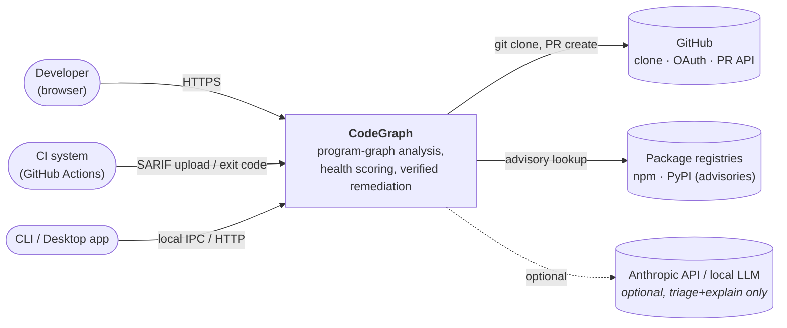
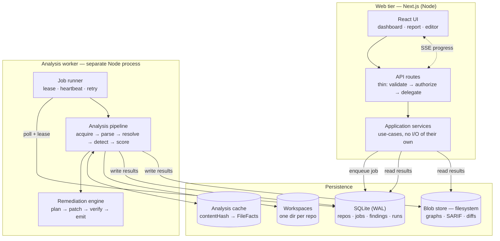
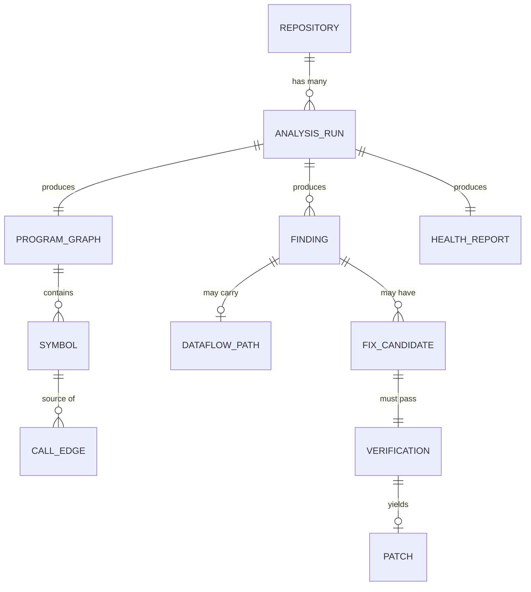
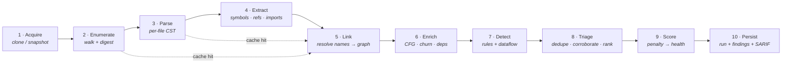
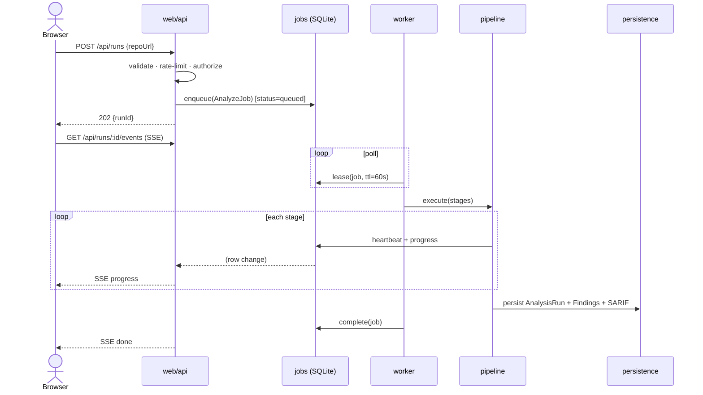
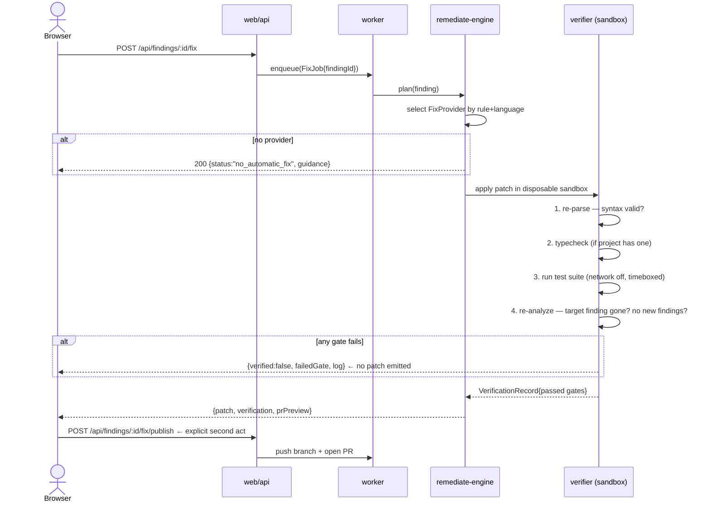
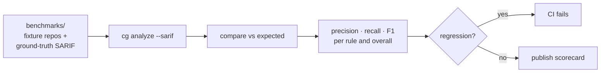
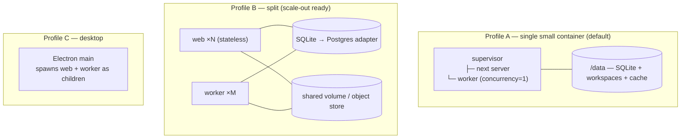

# CodeGraph — High-Level Design (HLD)

| | |
|---|---|
| **Version** | 2.0 (target architecture) |
| **Status** | Proposed — supersedes the implicit architecture described in `ARCHITECTURE.md` |
| **Date** | 2026-07-29 |
| **Companion docs** | [`IDENTITY.md`](./IDENTITY.md) *(binding)* · [`LLD.md`](./LLD.md) · [`SPIKES.md`](./SPIKES.md) · [`DETECTION_ENGINE.md`](./DETECTION_ENGINE.md) · [`REVIEW_2026-07-29.md`](../REVIEW_2026-07-29.md) |
| **Audience** | Engineers implementing v2; reviewers evaluating the system design |

---

## 1. Purpose

CodeGraph makes a codebase visible, then judges it, then fixes it — in one place, with no API
key and no service to sign up for. The program graph is not plumbing behind a findings list; it
is the interface. Everything else is a lens on it: the Health Score summarises it, Code
Intelligence queries it, the swarm reasons over it, the Editor acts on it, Timeline shows how it
moved.

**[`IDENTITY.md`](./IDENTITY.md) is binding on this document.** Where an architectural choice
would trade a distinctive property for a conventional one, identity wins.

This document defines the target architecture. It exists because v1 grew organically into a
shape that blocks the next three things the product needs:

1. **Detection quality** — v1 detects with line-level regexes over raw text. This has a
   structural ceiling on precision that no amount of rule-tuning can raise (§ [DETECTION_ENGINE.md](./DETECTION_ENGINE.md)).
2. **Remediation credibility** — v1's `verified` flag is graded by the same metric the fix
   was built to move, and no fix is tied to the finding that motivated it.
3. **Operational headroom** — expensive analysis runs synchronously inside HTTP handlers in a
   single process, so one `/fix` call stalls the instance.

v2 addresses all three with one structural change: **separate the analysis engine from the
web application**, and make the engine a pipeline of small, independently testable stages
with explicit contracts between them.

---

## 2. Goals and non-goals

### 2.1 Goals

| # | Goal | Measured by |
|---|---|---|
| G1 | Detection precision high enough that a developer trusts the P0 list | ≥ 0.85 precision on a curated benchmark suite (§9.3) |
| G2 | Every remediation is tied to a specific finding and proven safe | 100 % of emitted patches carry a `findingId` + a passing verification record |
| G3 | The codebase is modular enough that a new language or new rule is an additive change | Adding a language = 1 new package, 0 edits to core; adding a rule = 1 new file |
| G4 | Expensive work never blocks the request path | p99 latency of any HTTP route < 500 ms, excluding SSE streams |
| G5 | Analysis is incremental | Re-analysis of a repo with 1 changed file costs < 5 % of a cold run |
| G6 | Results are interoperable without diluting the product | SARIF 2.1.0 export; findings ingestible by GitHub code scanning — as an adapter, not the internal model |
| G7 | The system is observable | Every stage emits structured duration/outcome; failures are attributable to a stage |

### 2.2 Non-goals

- **Cross-repo search at scale.** Sourcegraph's domain. CodeGraph indexes one repo deeply.
- **Whole-program soundness.** We optimise for precision on the common case, not for proving
  the absence of bugs. We will under-report rather than over-report.
- **Being an LLM wrapper.** The core engine stays deterministic and API-key-free. LLM usage
  is confined to an optional, clearly-labelled triage/explanation layer that can never
  *create* a finding, only rank or explain one.
- **Multi-tenant SaaS at scale.** Single-instance self-host remains the primary deployment.
  The architecture must not *preclude* horizontal scale, but v2 does not ship it.

---

## 3. Quality attributes (NFRs)

| Attribute | Requirement | Architectural mechanism |
|---|---|---|
| **Performance** | Cold index of a 100 kLOC repo ≤ 90 s on 1 vCPU | Stage-parallel pipeline, bounded worker pool, streaming file scan |
| **Incrementality** | Warm re-index ≤ 5 % of cold | Content-addressed per-file analysis cache (Merkle-style file digest → cached `FileFacts`) |
| **Memory** | Peak RSS ≤ 400 MB on a 512 MB container | Out-of-process analysis worker that is *killed and respawned* per job; WASM heap never accumulates in the web process |
| **Availability** | A failed/OOM job never takes down the web tier | Process isolation between web and worker (the core fix for `2026-07-10-tree-sitter-oom`) |
| **Durability** | No analysis result lost on restart mid-job | Jobs are persisted rows with a lease + heartbeat; orphaned jobs are requeued on boot |
| **Security** | No path escape, no SSRF, no token leak, no cross-tenant read | Capability-scoped filesystem handles, normalised IP validation, session-only credentials, `owner_id` predicate pushed into every query |
| **Testability** | Every stage runnable in isolation from a fixture directory | Pure functions over explicit inputs; no module-level mutable state; injected clock/fs/git |
| **Extensibility** | New rule = one file + one test; new language = one package | Registry pattern with declarative rule manifests |
| **Interoperability** | Results consumable by third-party tooling | SARIF 2.1.0 **export adapter** at the boundary; CodeGraph's `Finding` stays the internal model (ADR-006) |

---

## 4. System context (C4 — Level 1)



**Boundary rule:** every external dependency is optional except `git`. The product must
produce a full health report with the network disabled after clone.

---

## 5. Container view (C4 — Level 2)

The single defining change from v1: **the analysis engine is a separate process.**



### 5.1 Why the worker is a separate process (not a thread, not inline)

| Property | Inline (v1) | Worker thread | **Separate process (v2)** |
|---|---|---|---|
| WASM heap growth reclaimed | ✗ never | ✗ per-thread heap still leaks | **✓ process exit reclaims all** |
| OOM blast radius | whole server | whole server (V8 heap shared) | **worker only; web tier survives** |
| CPU isolation from event loop | ✗ | partial | **✓** |
| Can be moved to another host later | ✗ | ✗ | **✓ (poll loop → queue is a swap)** |
| Implementation cost | — | low | moderate |

This directly retires the two worst constraints in `ARCHITECTURE.md`: the tree-sitter RSS
gate (`CG_TREE_SITTER_MAX_RSS_BYTES`) becomes unnecessary because the heap dies with the
process, and *"an unhandled crash mid-job takes the whole server down"* stops being true.

---

## 6. Component view (C4 — Level 3): target module map

Packages, not folders. Each is independently unit-testable, has an explicit public surface,
and may only depend **downward** in this list.

```
apps/
  web/                     Next.js app — UI + API routes only. No analysis logic.
  worker/                  Job runner process. Owns the pipeline lifecycle.
  cli/                     Headless entry: `codegraph analyze <path> --sarif`
  desktop/                 Electron shell. Wraps web + worker.

packages/
  core-domain/             Pure types + invariants. Zero dependencies. Zero I/O.
  core-graph/              Program graph model: symbols, edges, CFG, queries.
  lang-*/                  One package per language. lang-typescript, lang-python, …
  detect-engine/           Rule registry, dataflow/taint solver, finding production.
  detect-rules/            Declarative rule definitions (data, not code, where possible).
  score-engine/            Health model: penalty → dimension → overall. Pure.
  remediate-engine/        Fix providers, patch application, verification harness.
  swarm/                   Specialist/critic/judge orchestration over findings.
  persistence/             Repositories over SQLite. The only module that writes SQL.
  jobs/                    Queue abstraction, lease/heartbeat, retry policy.
  vcs/                     git + GitHub adapters. The only module that shells out to git.
  fsx/                     Capability-scoped filesystem. The only module doing raw fs.
  sarif/                   SARIF 2.1.0 export adapter (outbound only).
  observability/           Structured logging, metrics, tracing spans.
  config/                  Typed, validated environment configuration.
```

### 6.1 Dependency rule (enforced in CI)

```
apps/*  →  swarm, remediate-engine, detect-engine, score-engine, persistence, jobs, sarif
detect-engine  →  core-graph, core-domain, fsx
core-graph     →  core-domain
lang-*         →  core-domain            (a language package never imports the engine)
persistence    →  core-domain
```

**Nothing** may import `apps/*`. **Nothing** below `persistence` may import it. Cycles are a
build failure, checked by `dependency-cruiser` in the lint job.

This is what makes G3 true: a new language is a new `lang-*` package registered in a manifest;
the engine never learns its name.

---

## 7. Core domain model

The vocabulary the whole system shares. Defined once in `core-domain`, referenced everywhere.



**Key modelling decisions:**

- **`AnalysisRun` is the unit of immutability.** A repo does not "have a score"; a *run* has a
  score. This makes the Timeline feature natural instead of bolted-on, makes score deltas
  well-defined, and lets two runs be compared without re-analysis.
- **`Finding` carries provenance.** `{ruleId, engine, evidence, dataflowPath?, confidence, confidenceBasis}`.
  A finding must be able to explain *why* it believes itself. This is the precondition for
  ever trusting a P0 list.
- **`FixCandidate` is separate from `Patch`.** A candidate is a proposal; a patch only exists
  after a `Verification` passes. There is no path in the type system from "we thought of a
  fix" to "here is a diff" that skips verification.

---

## 8. The analysis pipeline

The heart of the system. A linear sequence of stages with typed inputs and outputs, each
independently cacheable and testable.



### 8.1 Stage contract

Every stage implements the same shape:

```ts
interface Stage<In, Out> {
  readonly name: string;
  readonly cacheable: boolean;
  run(input: In, ctx: PipelineContext): Promise<Out>;
}
```

`PipelineContext` carries the logger, the cancellation signal, the clock, the cache handle,
and a `budget` (time + memory). A stage that exceeds budget degrades — it does not throw. The
pipeline records the degradation in the run so the UI can say *"partial analysis: parse budget
exhausted at 3,412/8,900 files"* instead of silently producing a wrong score.

### 8.2 Caching boundary (delivers G5)

Stages 3–4 are **per-file and pure**: `(contentHash, language, extractorVersion) → FileFacts`.
That tuple is the cache key. This mirrors the content-addressed model used by Bazel and
Turborepo — cache on *what the content is*, not *when it changed*, so reverting a file is
also a cache hit.

Stages 5–9 are whole-program and must re-run, but they operate on `FileFacts` (small,
structured) rather than source text, so they are 10–50× cheaper than parsing. A one-file
change in a 5,000-file repo re-parses one file and re-links the graph.

### 8.3 Degradation ladder

Rather than one binary `truncated` flag, the run records an explicit analysis *tier* per file:

| Tier | Meaning | Detection capability available |
|---|---|---|
| `full` | Typed AST (TS compiler / equivalent) | Type-aware rules, precise call resolution, interprocedural taint |
| `ast` | Untyped AST (tree-sitter) | Structural rules, intraprocedural dataflow, heuristic call resolution |
| `lexical` | Regex/token scan only | Syntactic rules only; **findings marked low-confidence** |
| `skipped` | Too large / binary / budget exhausted | none — reported as coverage gap |

**Implemented 2026-07-30.** `tierForExt` assigns the tier, `ScanCoverage.tierLoc` reports LOC per
tier, and a `lexical` finding's confidence is scaled by 0.45 — which now reaches the score,
because confidence multiplies into `expectedHarm`. On this repository 56.7% of LOC is at tier
`full`; the rest is Python, scanned by regex, and now says so.

Two honest notes. **`ast` is defined and never produced**: every language with an AST path here
is TypeScript-family and goes through the compiler (`full`), while Python's extractor is
regex-based (`lexical`). The rung is real in the design and empty in the code until a
tree-sitter grammar for a non-TS language fills it. And the downgrade **never deletes** — an
incomplete picture of a file is a reason to weigh its findings less, not to go silent on every
non-TypeScript file in the repository.

The health report publishes **analysis coverage** (`% of LOC at tier ≥ ast`) next to the
score. A 92/100 over 40 % coverage is a different claim than 92/100 over 98 %, and the product
should never conflate them. This is the single highest-integrity change available at low cost.

---

## 9. Key flows

### 9.1 Index a repository



**Failure semantics:** if the worker dies, the lease expires and the job is requeued with
`attempts+1`. After `maxAttempts` it lands in `failed` with the last stage name — so the user
sees *"failed during Link (attempt 3/3)"*, not a bare 500.

### 9.2 Remediate a finding (delivers G2)

This is the flow v1 gets wrong. The corrected version:



Two structural changes from v1:

1. **Four gates, not one.** Syntax → types → tests → re-analysis. The v1 gate ("score didn't
   drop") is gate 4 *only*, and gate 4 alone is circular. Gates 1–3 are what make the word
   *verified* mean something. If a repo has no test suite, the response says
   `verified: partial (no test suite)` — it does not silently claim full verification.
2. **Publishing is a separate, explicit request.** Nothing pushes to a user's remote as a
   side effect of asking for a diff.

### 9.3 Evaluate the detector (delivers G1)

Detection quality must be a **CI-gated number**, not an opinion.



Ground truth comes from three sources, in increasing order of realism: hand-written fixtures
per rule (fast, deterministic), the Juliet/OWASP-style seeded-vulnerability corpora
(exhaustive but synthetic and known to be unrepresentative of real code), and a small set of
real repos with manually adjudicated findings. The literature is consistent that synthetic
benchmarks flatter tools; the real-repo set is the one that matters, even at n=5.

---

## 10. Job & concurrency model

| Concern | Design |
|---|---|
| **Queue** | SQLite table `jobs` with `status`, `lease_until`, `attempts`, `payload`. Polled by workers with `UPDATE ... WHERE status='queued' AND lease_until < now RETURNING *` (atomic under WAL). |
| **Why not Redis/SQS** | It would be the only external dependency in a product whose pitch is "one container, one file". The `JobQueue` interface makes swapping it a 200-line adapter if scale ever demands it. |
| **Concurrency** | `CG_WORKER_CONCURRENCY` (default 1 on ≤1 vCPU, `min(cpus-1, 4)` otherwise). Per-repo mutex: never two runs on the same workspace. |
| **Backpressure** | Global queue-depth cap. Over cap → `429` with `Retry-After`, not an unbounded accept. |
| **Cancellation** | `AbortSignal` threaded through `PipelineContext`; every stage checks between files. Cancel is a status write the worker observes on heartbeat. |
| **Idempotency** | Job payloads carry an `idempotencyKey = hash(repoId, commitSha, engineVersion)`. Re-submitting returns the existing run. |
| **Poison-pill defence** | A job that OOM-kills its worker twice is quarantined rather than retried forever. |

---

## 11. Data architecture

### 11.1 Storage split

| Data | Store | Rationale |
|---|---|---|
| Repos, runs, jobs, findings (metadata) | SQLite | Queryable, transactional, small rows |
| Program graph, viz layouts, SARIF, diffs | Filesystem blobs, gzipped, referenced by `runId` | v1 stores 10 JSON blobs in the `repos` row and `getRepo()` parses all of them for every call, including for a fan-out loop in `/api/fleet`. Blobs must be lazily loadable. |
| Per-file analysis cache | Content-addressed files under `cache/<hash-prefix>/<hash>.json` | Trivially prunable by LRU; survives restarts |
| Workspaces | One directory per repo | Unchanged from v1 |

### 11.2 The single biggest persistence fix

v1's `repos` table is a document store pretending to be a table: 10 JSON columns, mutated in
place, with `getRepo()` as the only read path. Findings are a JSON blob, so they cannot be
queried, filtered, paginated, counted by severity, or diffed between runs without loading and
parsing everything.

v2 promotes findings to **rows**:

```
findings(id, run_id, rule_id, severity, confidence, file, start_line, end_line,
         symbol_id, fingerprint, dimension, blast_radius, churn, score, priority,
         status, dataflow_path_ref, created_at)
```

`fingerprint` is a location-independent content hash (rule + normalised code context +
symbol), which is what makes *"this finding is the same one you dismissed last week, in a
file that has since moved"* possible. That single column unlocks: suppression, baselines
("only show findings new since main"), trend lines, and PR-scoped analysis — the four features
that separate a demo scanner from one a team leaves switched on.

---

## 12. Security architecture

Carried forward from v1 (which is already strong here) plus the gaps identified in review.

| Control | v2 mechanism |
|---|---|
| Path traversal | `fsx` exposes only `WorkspaceHandle` capabilities; raw `fs` is lint-banned outside `fsx`. Symlink resolution checked *after* `realpath`, on every access, not once. |
| SSRF | IP validation on the *normalised* host: decimal/octal/hex integer forms, IPv4-mapped IPv6, CGNAT `100.64/10`, `.internal`/`.local` suffixes. Resolve-then-pin where the transport allows it. |
| Credential handling | Tokens are read **only** from the encrypted session. No route accepts a token in a body or query. `vcs` is the only module that may construct an authenticated remote URL, and it redacts on every error path. |
| Tenant isolation | `owner_id` is a mandatory predicate in the repository layer, not a per-route check. A query without it fails a lint rule. 404-not-403 preserved. |
| Command injection | `git` invoked argv-only via `vcs`; `child_process` lint-banned elsewhere. |
| Untrusted code execution | The verification sandbox *runs the target repo's tests*. This is the highest-risk addition in v2 and must be containerised: no network, read-only root except the workspace, CPU/memory/pid limits, wall-clock kill. **Off by default on shared deployments** (`CG_ALLOW_TEST_VERIFICATION`). |
| Supply chain | Lockfile committed, `npm audit` in CI, Dependabot, pinned base image digest. |

> **Explicit risk acceptance:** running a cloned repo's test suite is arbitrary code execution
> by design. It is the only way to make `verified` honest. The mitigation is containment plus
> an off-by-default flag on multi-tenant hosts — not avoidance.

---

## 13. Deployment topology



Profile A is the shipping default and the CI-tested target (512 MB / 0.5 vCPU, matching the
existing adversarial smoke test). Profiles B and C are enabled by the same interfaces
(`JobQueue`, `BlobStore`, `Database`) with different adapters — no core changes. Profile C is
the existing `desktop/` app, which v2 brings under CI.

---

## 14. Observability

| Signal | Implementation |
|---|---|
| **Logs** | Structured JSON, one line per event, with `runId`/`jobId`/`stage` on every line. `pino`. Never `console.log` outside `observability`. |
| **Metrics** | Counters/histograms exposed at `/api/metrics` (Prometheus text format): `cg_stage_duration_seconds{stage}`, `cg_run_total{outcome}`, `cg_findings_total{rule,severity}`, `cg_cache_hit_ratio`, `cg_queue_depth`, `cg_verification_total{gate,outcome}`. |
| **Traces** | OpenTelemetry spans per stage, parented to the run. Off unless `OTEL_EXPORTER_OTLP_ENDPOINT` is set. |
| **Run record** | Every run persists its own stage timings and degradations — self-observability that works with no external stack, which matters for the self-host story. |

`cg_verification_total{gate,outcome}` is the metric that keeps the product honest: it makes
"how often does our fix actually pass the tests?" a number on a dashboard rather than a claim
in a README.

---

## 15. Architecture Decision Records

Condensed. Each has the form *decision · alternatives · consequences*.

**ADR-001 — Analysis runs in a separate OS process.**
*Alternatives:* inline (v1), worker threads. *Consequences:* + reclaims WASM memory, isolates
OOM, unblocks the event loop, enables later scale-out. − IPC boundary, slightly harder local
debugging, two processes to supervise. **Accepted.** This is the load-bearing decision.

**ADR-002 — SQLite stays; findings become rows, blobs move to files.**
*Alternatives:* Postgres now; keep JSON columns. *Consequences:* + keeps the one-file
self-host pitch, makes findings queryable, kills the `/api/fleet` fan-out. − manual migration
of existing rows; SQLite write concurrency remains a single-writer model (acceptable at
Profile A). **Accepted.**

**ADR-003 — Findings are produced by a rule engine over the program graph, not by regex over text.**
*Alternatives:* keep regex; depend on an external engine (see ADR-004). *Consequences:* + large
precision gain; + dataflow becomes expressible; + rules become data, written in CodeGraph's own
graph vocabulary so a finding is navigable in the graph views. − real implementation cost; must
be phased so the regex tier survives as an explicit low-confidence fallback. **Accepted** —
detailed in [`DETECTION_ENGINE.md`](./DETECTION_ENGINE.md).

**ADR-004 — CodeGraph builds its own detection engine; external engines are optional enrichers at most.**
*Rationale, in priority order:* (1) **Identity** — a rule engine is user-facing surface, and
shipping someone else's rule syntax and finding model would make every contributor's first
thought *"this is that tool, but smaller"* ([`IDENTITY.md`](./IDENTITY.md) §4.1). (2) **Fit** —
findings must be navigable *in the graph*, which requires the detector to speak in symbols and
edges rather than emit an external report we then try to re-attach. (3) **Constraints** — the
mature options each break "one container, no key, MIT": paid interfile tiers, licences that
restrict non-OSS use, heavyweight binaries in a 512 MB container.
*Consequence:* a lower analysis ceiling than a dedicated scanner, accepted deliberately — see
`DETECTION_ENGINE.md` §5.3 for what each rung of detection quality actually buys the workbench.
An optional adapter may enrich results where an operator already has such a tool installed.

**ADR-005 — `verified` requires syntax + type + test + re-analysis gates.**
*Alternatives:* keep the re-analysis-only gate. *Consequences:* + the central product claim
becomes defensible; − requires sandboxed execution of untrusted tests (see §12), and far fewer
findings will be auto-fixable. **Accepted** — a smaller set of genuinely verified fixes is
worth more than a large set of unverified ones. *Confirmed constraint ([`SPIKES.md`](./SPIKES.md)
§2): Render does not permit privileged containers, so gate 3 cannot run on the hosted demo. The
gate is tiered by host capability — `verified: full` on CLI/desktop/self-hosted Docker,
`verified: partial` on Render — and the CLI is built first.*

**ADR-006 — CodeGraph's `Finding` is the internal model; SARIF 2.1.0 is a boundary export.**
*Alternatives:* adopt SARIF as the canonical internal format. *Rationale for rejecting that:*
our `Finding` carries analysis tier, confidence basis, symbol identity, and graph provenance —
several of which have no natural SARIF home, and all of which the product's own UI depends on.
An internal type shaped by what a wire format can express is how a product becomes a commodity
scanner with extra steps ([`IDENTITY.md`](./IDENTITY.md) §4.3). *Consequences:* + SARIF export
still buys free CI integration and interoperability; + reading its spec is a useful checklist
for what a finding model must handle; − we maintain a mapping layer. **Accepted.**

**ADR-007 — Deterministic core; LLM strictly optional and non-generative of findings.**
*Consequences:* the "no API key required" claim survives; an optional triage layer may
*suppress* or *explain* a finding but never *create* one, so results stay reproducible.
Any LLM-touched finding is flagged as such in the UI and in SARIF properties.

**ADR-009 — Cross-project score calibration is the wrong target; CodeGraph indexes one repo
deeply.** Universal learned weights are not shipped and no cross-project AUC is chased: that
metric measures transfer from other people's repositories, a handicap this product never wears
(§2.2). The measured failure was base-rate non-transfer, which cannot occur within one
repository. *Consequences:* the kernel stays hand-picked and says so; per-file risk ranking is
validated against the indexed repo's own history; the corpus, the fitting pipeline and
`@codegraph/calibrate` are DELETED — within-repo work needs the repo in hand, not twelve
strangers'. Full record: [`ADR-009`](./ADR-009-score-calibration.md).

**ADR-008 — The Health Score is the single headline metric, and it reports its own coverage.**
*Consequences:* a score computed over 40 % analysed LOC can no longer masquerade as one
computed over 98 %. Costs a small amount of UI real estate; buys the score its credibility.
*Corollary:* no second grade sits beside it — no letter ladder, no pass/fail badge. Remediation
effort is supporting detail, never a competing verdict ([`IDENTITY.md`](./IDENTITY.md) §4.2).

---

## 16. Risks

| Risk | Impact | Mitigation |
|---|---|---|
| Detection rewrite is large and could stall mid-way | High | Strangler-fig: new engine runs *beside* the regex engine behind a flag; both emit `Finding`s; compare on the benchmark corpus; cut over per-rule, not big-bang |
| Sandboxed test execution is a security hole | High | Containerised, network-off, resource-capped, off by default. **Confirmed unavailable on Render** (no privileged mode) — gate tiered by host, CLI-first ([`SPIKES.md`](./SPIKES.md) §2) |
| Two processes complicate the "one container" story | Medium | Supervisor keeps it one container and one command; document the process tree |
| Migrating existing SQLite rows | Medium | Versioned, forward-only migration runner with a dry-run mode and a pre-migration file copy |
| Monorepo move breaks the container at start, not at build | Medium | **Verified real** — standalone entrypoint moves to `.next/standalone/apps/web/server.js` ([`SPIKES.md`](./SPIKES.md) §1). Docker smoke test gates the migration |
| Fewer auto-fixes after ADR-005 | Medium (perceived regression) | Reframe: report *"3 findings with verified fixes, 66 with guided remediation"*. Honest numbers, and invest fix providers where they pay off |
| Scope creep from `desktop/`, `fleet/`, `timeline/` | Medium | Each gets an explicit status label in the README: `stable` / `beta` / `experimental`. Experimental features are excluded from the pitch, not from the repo |

---

## 17. Phased delivery — SUPERSEDED

> **This section is superseded by [`PLAN.md`](./PLAN.md) (v2.0, 2026-07-30).** Follow that
> document. The table below is retained because §18's traceability rows and several ADRs cite
> its phase numbers, and because the resequence is easier to judge against what it replaced.
>
> **What changed:** the order, plus one addition. Same work, same architecture, same exit
> criteria. Old P3 (detection) and P4 (remediation) swap, and a score-credibility phase is
> inserted — so P3 is now the verification harness, P4 is calibration, and detection becomes P5.
> **Phase numbers below do not match PLAN.md's from P3 onward.**
>
> The reason is a sequencing fact rather than a change of mind: the four-gate harness operates on
> a patch and a sandbox, so it depends on nothing detection produces and runs against the three
> fixers that already exist. It sat behind two phases of detection work because of document
> order. Meanwhile review item C3 — `verified = after.score >= before.score`, graded by the very
> metric the fix was built to move — is live in shipped code, so every week it stays is a week
> the README claims something the code does not do.

Each phase is independently shippable and leaves the product working. Two phases have a
dependency on P3 that the table above does not show — see the notes below §17's table.

| Phase | Theme | Key outcomes | Exit criteria |
|---|---|---|---|
| **P0** *(days)* | Stop the bleeding | Brace-less-JS fixer bug; PR `res.ok` + default-branch detection; token from session only; rate-limit `/fix` | Review items P0 closed, regression tests green |
| **P1** *(1–2 wk)* | Extract the seams | `core-domain`, `persistence`, `fsx`, `vcs`, `config`, `observability` packages; dependency-cruiser gate; findings → rows + fingerprints | No analysis logic left in `src/app/**`; dependency graph acyclic |
| **P2** *(1–2 wk)* | Get the work off the request path | `jobs` + worker process; SSE progress; cancellation; per-repo mutex; staged extraction per LLD §13.2 (`core-domain`, `vcs`, `core-graph`, transitional `analysis`) | `/fix` and `/agents` are 202 + poll; p99 route latency < 500 ms; no analysis runs in the web process |
| **P3** *(2–3 wk)* | Make detection real | `detect-engine` with rule registry + intraprocedural dataflow; `lang-typescript` at `full` tier; SARIF export; benchmark harness + CI gate | Precision ≥ 0.85 on benchmark; regex tier demoted to fallback; `Edge.resolution: "exact"` call-edge coverage measured and reported (no numeric target set — the benchmark corpus this needs doesn't exist yet, see the note below) |
| **P4** *(2 wk)* | Make remediation honest | Finding-scoped fix providers; 4-gate verification; explicit publish step | 100 % of patches carry `findingId` + `VerificationRecord` |
| **P5** *(2 wk)* | Scale & incrementality | Content-addressed cache; interprocedural taint; PR-scoped/baseline mode | Warm re-index < 5 % of cold; new-findings-only view works |
| **P6** *(1 wk)* | Close the docs gap | `desktop/` in CI; feature status labels; README claims reconciled with code | Every README claim maps to a passing test |

**P2 has a structural dependency on P3's package layout, and it is not optional.** `apps/worker`
(LLD §1) cannot import `apps/web`: `no-cross-app-imports` forbids it, and that rule is exactly
what makes the process boundary structural instead of a convention someone can quietly bypass.
But the analyse handler needs `indexRepo`, which still lives in `apps/web/src/lib` and which
LLD §13 routes to six packages P3 creates. So P2 cannot ship a worker without moving code the
plan assigns to P3, and neither obvious escape works: doing P3's five-way split early means
cutting a 901-line file inside a phase whose constraint is *no behaviour change*, while leaving
the worker inside `apps/web` delivers the process boundary without the enforcement — `store.ts`
could still call `indexRepo` in-process and the next route to copy it silently reintroduces the
OOM that ADR-001 exists to retire. **LLD §13.2 records the resolution:** P2 moves only what
already has a home (`types.ts` → `core-domain`, the `git` calls → `vcs`, which also closes a P1
layering gap) plus one transitional `analysis` package that P3 splits. The staging is a
consequence of this dependency, not a shortcut around it.

**P5 depends on P3's call-resolution quality, not just its calendar completion.** P5's cache
(LLD §5.3.1) is only sound if it invalidates every stale summary, which requires walking resolved
call edges backward from a changed file (LLD §5.3.1's `invalidate`). Measured on
`expressjs/express@a371447` post-P1 (`docs/REVIEW_2026-07-29.md`): the current extractor resolves
**11 call edges across 123 symbols** — far too sparse for that walk to find most real callers.
Starting P5 against that resolution quality produces a cache that appears to work (fast warm
re-index) while silently serving stale findings, which is worse than the unindexed baseline it
replaces. P5's entry criterion is therefore not "P3 is done" on the calendar but **P3's own exit
criterion (`Edge.resolution: "exact"` coverage, above) landing at a level where the reverse walk
is actually load-bearing** — expected to be true once `lang-typescript` reaches `full` tier
(TS compiler resolution, not tree-sitter heuristic matching), but stated as a measured gate here
rather than assumed. If P5 is pulled forward regardless, LLD §5.3.1 documents the required
fallback: invalidate on file-neighbourhood rather than resolved call edges, which is correct but
gives up most of the incrementality P5 exists to deliver.

**P3's precision gate has an unresolved prerequisite.** "Precision ≥ 0.85 on benchmark" needs a
ground-truth benchmark corpus — real vulnerable code with agreed-correct labels — to measure
against. SPIKES.md's Spike 2 found this can't be run under Render's own resource constraints, and
no such corpus currently exists in this repository. This is not closed by writing more detection
design; it is a separate, external dependency (build or source a labelled corpus, and decide
where CI runs the comparison) that should be resolved before P3 is scheduled, not discovered
during it.

## 18. Traceability — review findings → design response

| Review item | Addressed by |
|---|---|
| C1 fix ignores the finding | §9.2 flow, ADR-005, P4 |
| C2 fixers can't fix P0/P1 | §7 `FixCandidate`/`FixProvider` per rule, P4 |
| C3 circular verification | ADR-005 four gates, §14 `cg_verification_total`, P4 |
| C4 pushes to real repo / `res.ok` / `base:"main"` | §9.2 explicit publish step, P0 |
| C5 fabricated `projectedScore` | §11 findings-as-rows makes re-scoring cheap → simulate, not guess; ADR-008 |
| C6 undocumented desktop/fleet/timeline | §16 status labels, P6, §13 Profile C |
| B1 brace-less JS corruption | ADR-003 AST-based fixers; P0 hotfix first |
| B2 file-level blast radius | §8 stage 6 enrich + graph reachability; `DETECTION_ENGINE.md` §scoring |
| B3 hit cap saturation | `score-engine` damped aggregation, P3 |
| B4 module-global `seq` | §6 purity rule + `fingerprint` ids, P1 |
| B5 SSRF encodings | §12, P0/P1 |
| B6 unrate-limited blocking `/fix` | §10, P2 |
| B7 `/api/fleet` fan-out | §11.1 blob split + projection queries, P1 |
| B8 token from body | §12 credential handling, P0 |
